# Blogger

```bash
 _     _                             
| |__ | | ___   __ _  __ _  ___ _ __ 
| '_ \| |/ _ \ / _` |/ _` |/ _ \ '__|
| |_) | | (_) | (_| | (_| |  __/ |   
|_.__/|_|\___/ \__, |\__, |\___|_|   
               |___/ |___/           
```

- **Date WriteUp** : 25 / 05 / 2024
- **Difficulty**: Beginner, Easy

- **DATOS DE LA MAQUINA**
  - **Nombre**: blogger: 1
  - **Fecha de lanzamiento**: 4 Apr 2021
  - **Autor**: TheHackersBrain
  - **Serie**: blogger

- **Informacion de Archivo**
  - **Nombre de Archivo**: blogger.ova
  - **Tamaño del archivo**: 762 MB
  - **Descarga**
  [blogger.ova](https://download.vulnhub.com/blogger/blogger.ova) (Size: 762 MB)
  - **Checksum**
    - **MD5**: 9F69F447D8812E0E01104CA47A9B243B
    - **SHA1**: BB22A3A5577A26DB969B415F84701B143A27D4CC
    - **Format**: Virtual Machine (Virtualbox - OVA)
    - **Operating System**: Linux
    - **DHCP service**: Enabled
    - **IP address**: Automatically assign

- **Descripcion**
  
  James M Brunner, desarrollador web, ha creado recientemente un blog. Te contrató para probar la seguridad de su blog. Hackea tu camino al estilo Mr. Robot :)

- **Notas**
  
  Agregue blogger.thm al archivo /etc/hosts
  
  Esto funciona mejor con VirtualBox que con VMware. Tenga en cuenta que es posible que deba eliminar el inicio de sesión de la consola en "configuraciones de serie" para que esto se inicie (debido a vagrant).

## Indice de Contenidos


## Instalacion de la maquina

### Comprobacion de hash SHA1

Antes de instalar nada, compruebo que el fichero no ha sido manipulado comparando el hash del fichero con el proporcionado por la web de descarga.

certutil -hashfile blogger.ova SHA1
SHA1 hash de blogger.ova: bb22a3a5577a26db969b415f84701b143a27d4cc
CertUtil: -hashfile comando completado correctamente.

### Instalacion de maquina en VirtualBox

En VirtualBox accedo a Archivo > Importar servicio virtualizado.

Selecciono el fichero .ova descargado.

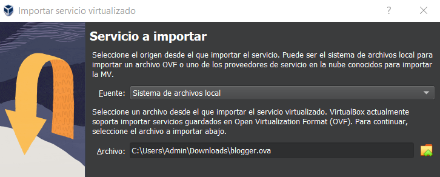

Pulso en Siguiente > Terminar.

## Resolucion de la maquina


### Fase de Fingerprinting / Reconocimiento (Reconnaissance)

#### Descubrimiento de IP objetivo en la red

```bash
sudo netdiscover -i eth0 -r 10.0.2.0/24
```

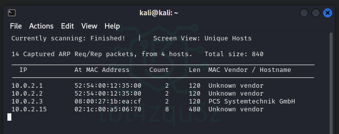

Segun me indican en las notas de la maquina hay que añadir la ip al hosts con el nombre blogger.thm

```bash
sudo nano /etc/hosts
```

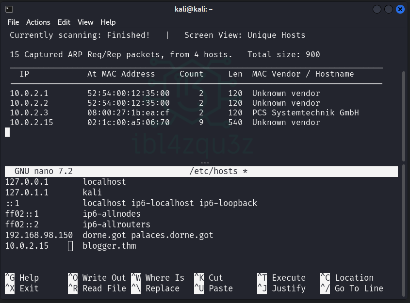

#### Descubrimiento de Puertos en objetivo

sudo nmap -sS -sC -sV -O 10.0.2.15

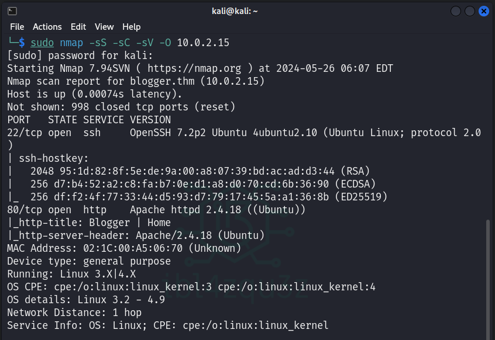

#### Resumen de los hallazgos

80/tcp open  http    Apache httpd 2.4.18
22/tcp open  ssh     OpenSSH 7.2p2

OS details: Linux 3.2 - 4.9

### Fase de Footprinting / Exploración (Scanning)

#### nikto

nikto -h 10.0.2.15:80

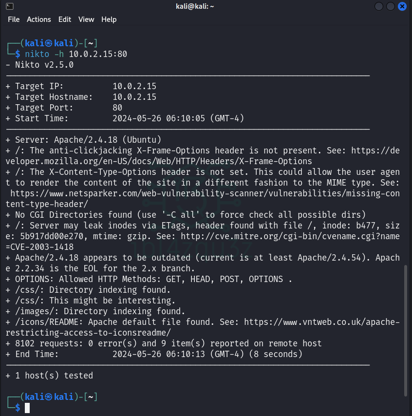

#### dirsearch

```bash
dirsearch -u http://10.0.2.15:80 -r -i200,301 
``` 

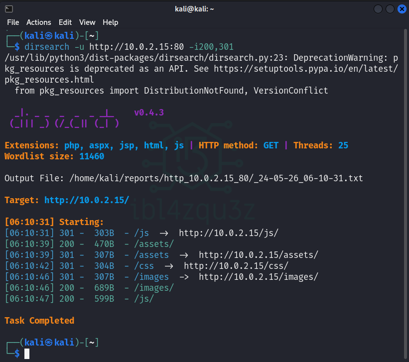

[06:10:31] 301 -  303B  - /js  ->  http://10.0.2.15/js/                     
[06:10:39] 200 -  470B  - /assets/                                          
[06:10:39] 301 -  307B  - /assets  ->  http://10.0.2.15/assets/             
[06:10:42] 301 -  304B  - /css  ->  http://10.0.2.15/css/                   
[06:10:46] 301 -  307B  - /images  ->  http://10.0.2.15/images/             
[06:10:46] 200 -  689B  - /images/
[06:10:47] 200 -  599B  - /js/     

Tambien realizo una busqueda recursiva sobre los directorios con el comando: 

```bash
dirsearch -u http://10.0.2.15:80 -r 
```

Obtengo resultados que se habian pasado por alto en la enumeracion anterior.

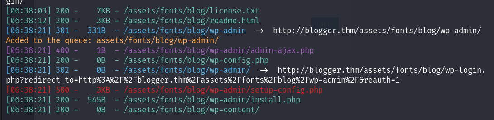

He obtenido que existe una instalacion de wordpress en `http://blogger.thm/assets/fonts/blog/` con un login en `http://blogger.thm/assets/fonts/blog/wp-login.php`

#### nuclei

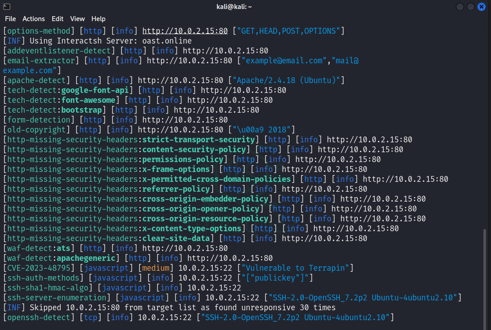

```bash
[CVE-2023-48795] [javascript] [medium] 10.0.2.15:22 ["Vulnerable to Terrapin"]
```

#### Escaneo con WPScan

```bash
wpscan --url http://blogger.thm/assets/fonts/blog/
```

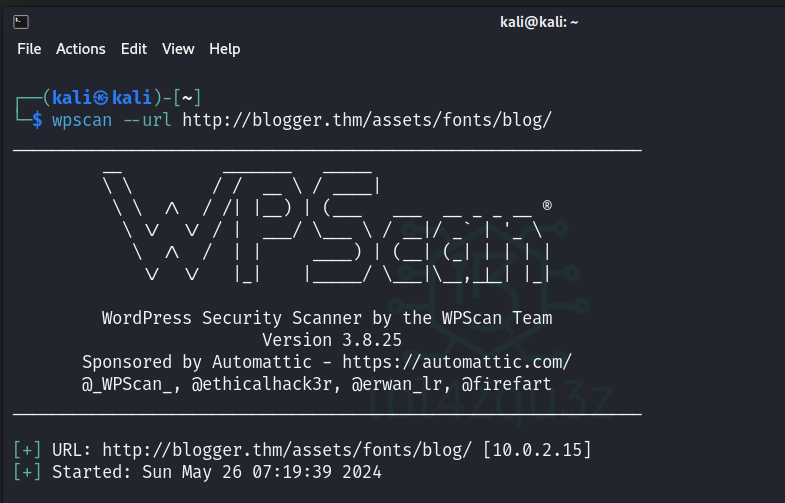

##### Enumeracion de usuarios en Wordpress

Ejecuto el comando con enumeracion de usuarios:

```bash
wpscan --url http://blogger.thm/assets/fonts/blog/ -e u
```

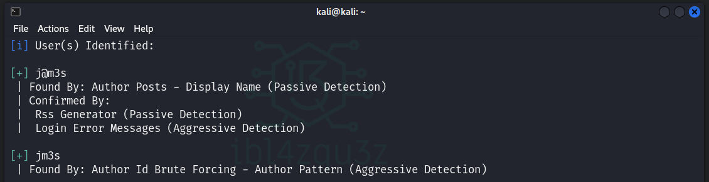

He conseguido encontrar dos usuarios: `j@m3s` y `jm3s`

Casualmente estos usuarios se asejeman al nombre de la persona que nos ha contratado para el pentesting **"James M Brunner"**

##### Enumeracion de pluggins vulnerables en Wordpress

```bash
wpscan --url http://blogger.thm/assets/fonts/blog --plugins-detection aggressive
```

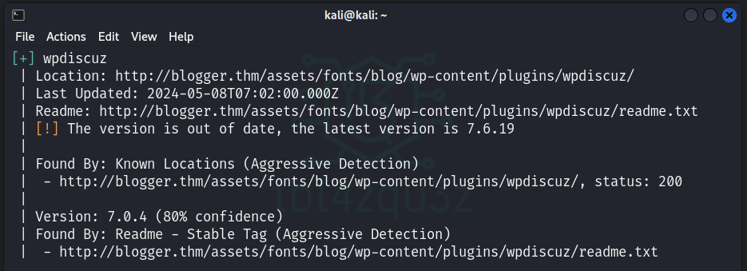

Detecto el pluggin wpdiscuz obsoleto con una version 7.0.4. 

Busco esta version en internet y me encuentro con [CVE-2020-24186](https://cve.mitre.org/cgi-bin/cvename.cgi?name=CVE-2020-24186) 

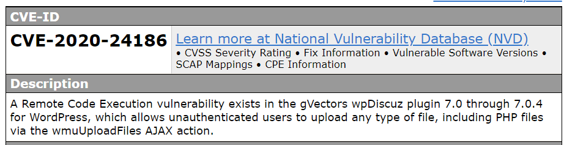

Esta version permite a usuarios no autenticados subir cualquier tipo de ficheros, incluyendo archivos PHP atraves de la AJAX wmuUploadFiles

Tambien encuentro un exploit https://www.exploit-db.com/exploits/49967


#### navegacion estandar


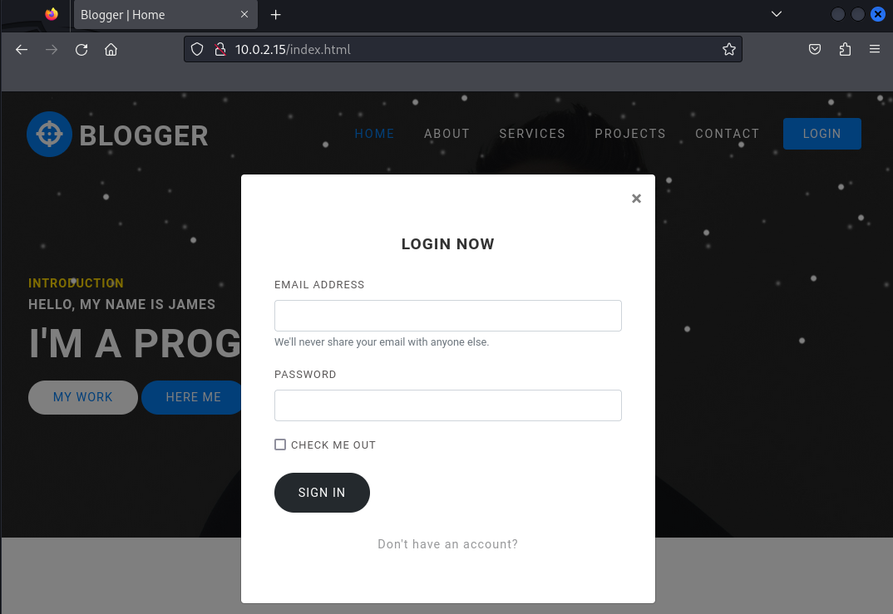

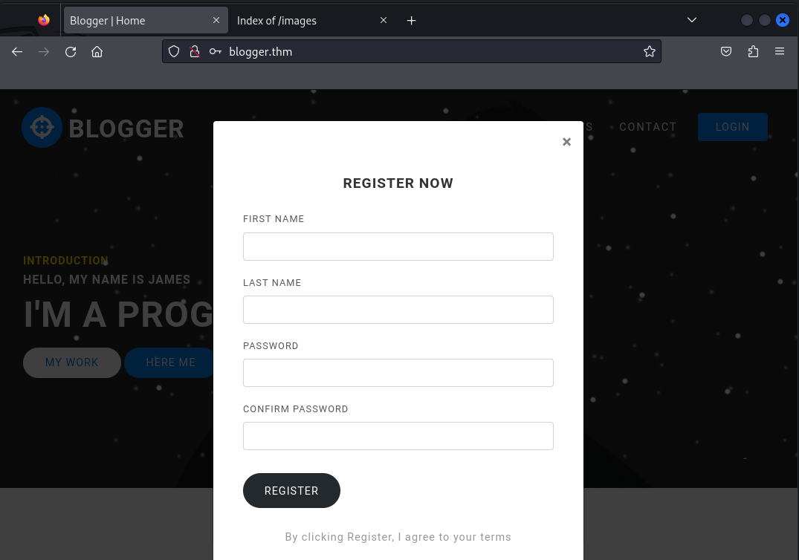

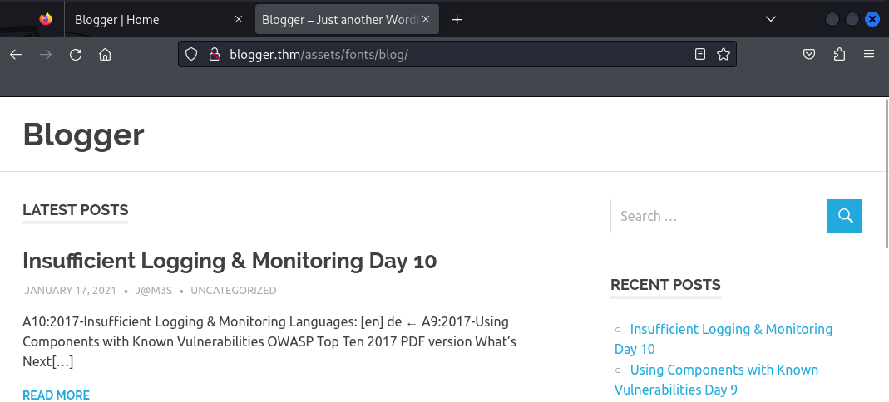

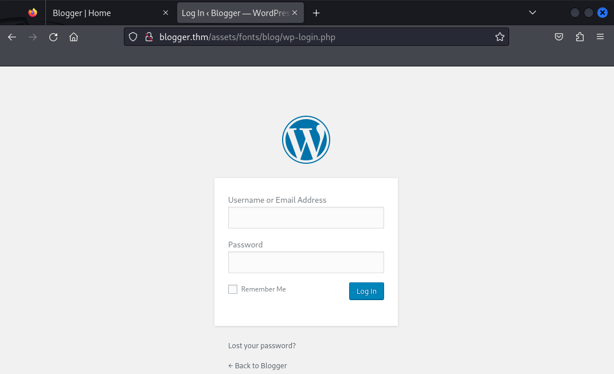


#### Exploracion puerto XXXX

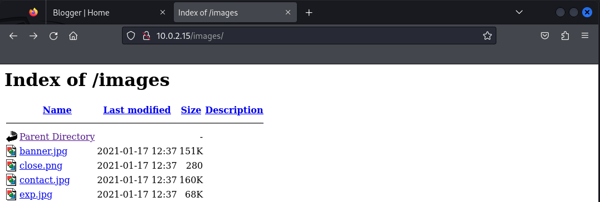


##### Resumen de resultados de la exploracion

### Fase de explotacion


#### Explotacion de pluggin wpdiscuz obsoleto ()

Como me permite subir cualquier tipo de ficheros voy a probar a subir una shell reversa en php desde la propia instalacion de wordpress que he localizado haciendo uso de esta vulnerabilidad.

Para conseguir una shell reversa puedo obtenerla de: 


#### Explotacion de pluggin wpdiscuz obsoleto (Metasploit)

Busco en metasploit por si hubiera un exploit para este plugging de wordpress.

```
search wpdiscuz
```

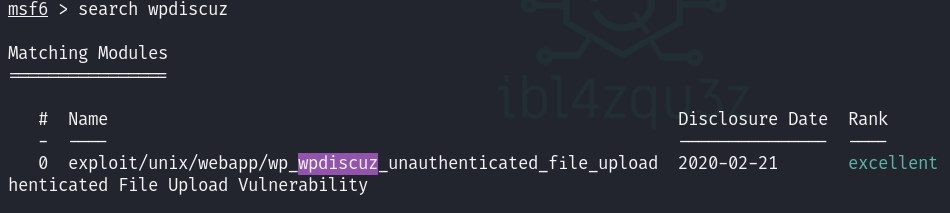

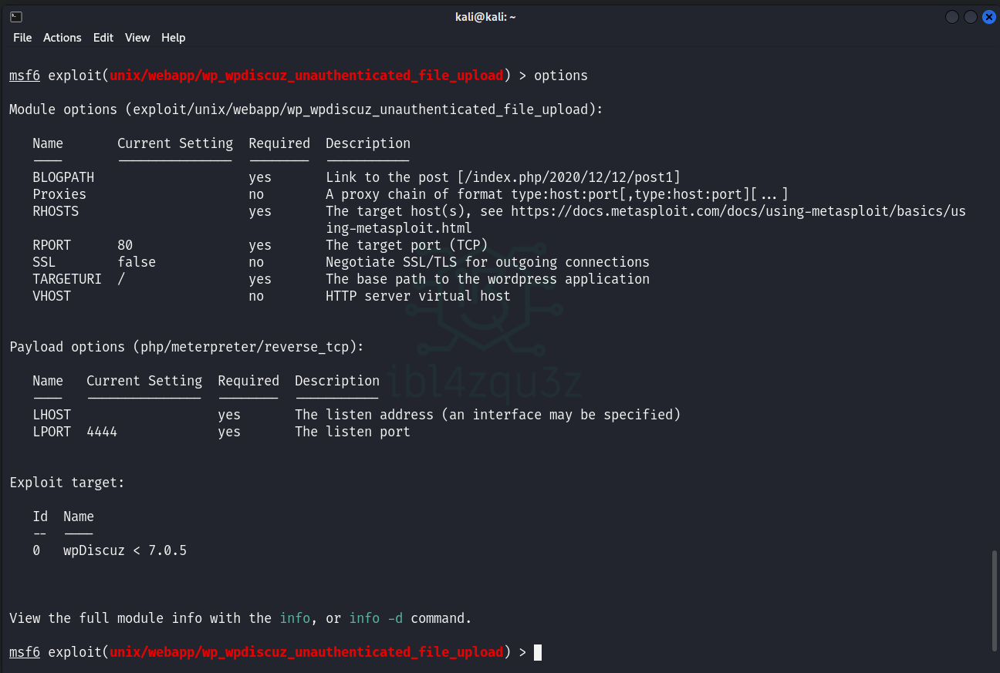

Configuro las opciones del exploit definiendo la ip de la maquina objetivo 10.0.2.15, la maquina atacante 10.0.2.14. Y definiendo un link a una entrada donde este funcionando el plugin wpdiscuz ```?p=1```, la raiz de la aplicacion wordpress ```/assets/fonts/blog/```.

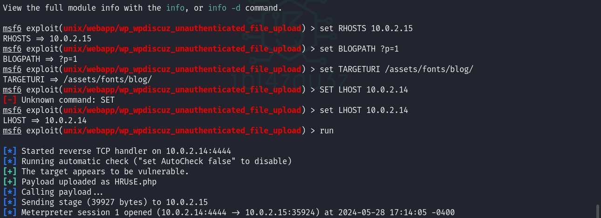

Una vez definido ejecuto el exploit con ```run``` y tras su ejecucion obtengo una sesion de meterpreter en la maquina objetivo.

Compruebo el usuario con el que he conseguido la shell en la maquina objetivo, compruebo tambien informacion de la maquina.

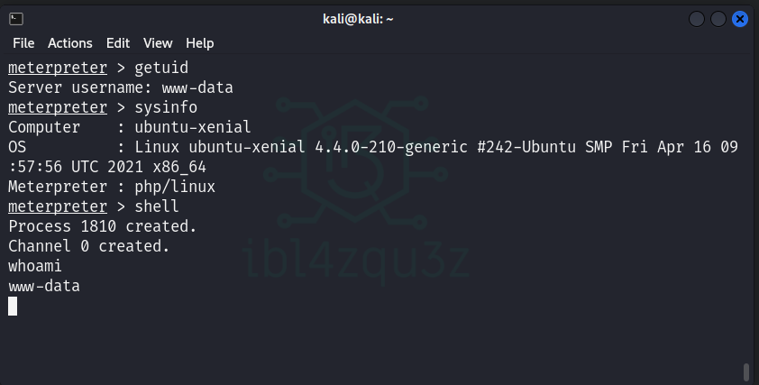

Ejecuto el comando shell y a continuacion ejecuto ```script /dev/null -c bash``` para registrar la salida del terminal que la redirijo a /dev/null para que no se guarde el registro y ejecuto el comando bash que inicia una nueva sesion de bash.

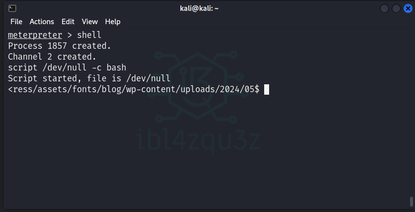


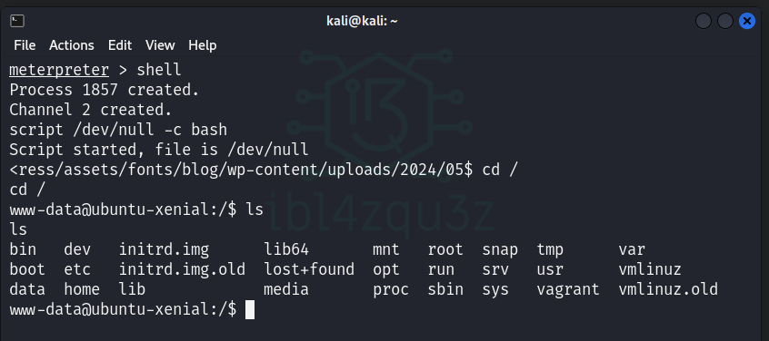

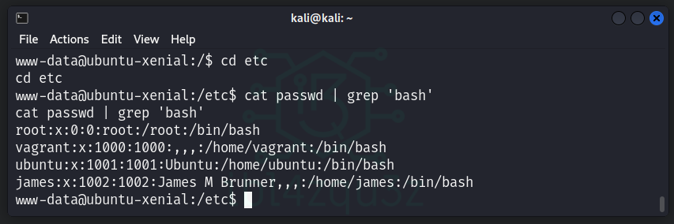

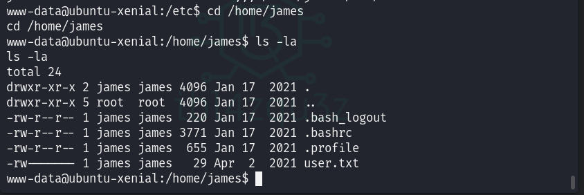

Busco en directorio tmp

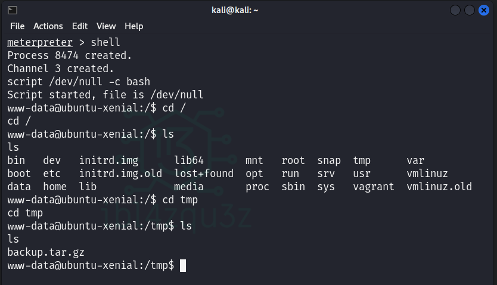

Encuentro un fichero backup.tar.gz que descomprimo obteniendo un fichero llamado user.txt.

Al comprobar el contenido veo que hay un texto que parece estar codificado en base 64

Decodifico y obtengo la flag

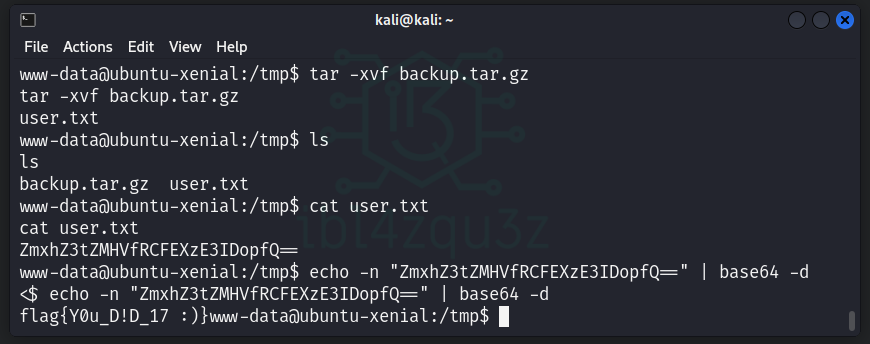

### Elevacion de privilegios

Necesito obtener privilegios para poder acceder al fichero user.txt y leer su contenido.


#### Intento de explotacion de usuarios con hydra

Usuario 1:

hydra -vV -l j@m3s -P /home/kali/Documents/Dictionaries/rockyou.txt 10.0.2.15:80/assets/fonts/blog http-post-form '/wp-login.php:log=^USER^&pwd=^PASS^&wp-submit=Log+In:F=is incorrect'

hydra -vV -L /home/kali/Documents/Dictionaries/rockyou.txt -p wedontcare 10.0.2.15:80/assets/fonts/blog http-post-form '/wp-login.php:log=^USER^&pwd=^PASS^&wp-submit=Log+In:F=Invalid username'
