# How to install on virtualbox

## Extraction

Once the download is complete, extract the “.rar” file. The folder contains the following files:

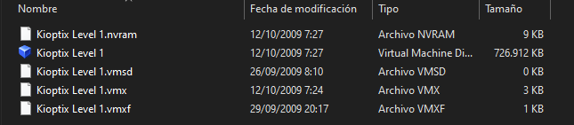

## Installation

Create a new machine in Virtual Box.
Set a name of your choice for your VM, select “Linux” & select a computer architecture.

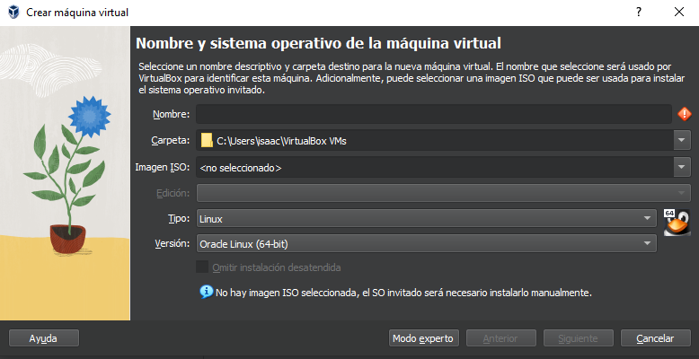

Define the minimum memory size to 1024 MB and Next.

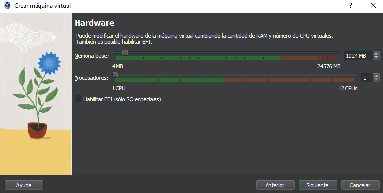

Select “Do not add a virtual hard disk”.

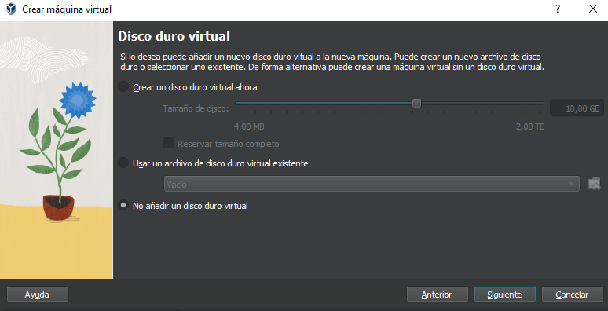

Acept all.

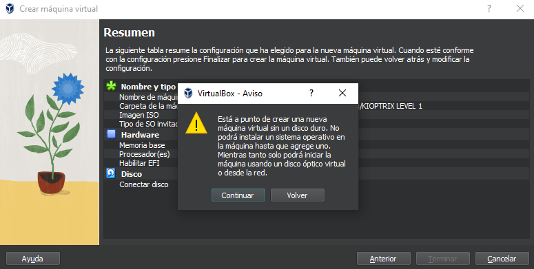

After creating, wait for your VM to appear in your VM.

### Create a NAT Network

If you didn't it before, you must do it now.

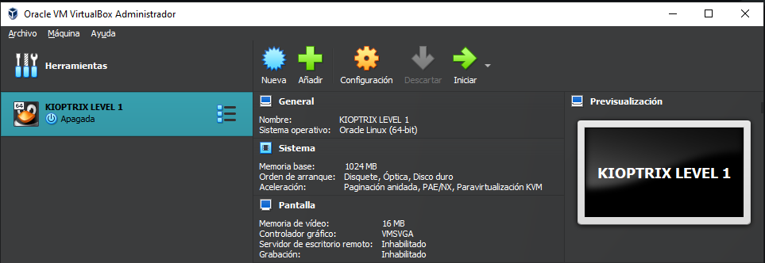

Click on Tools > Network 

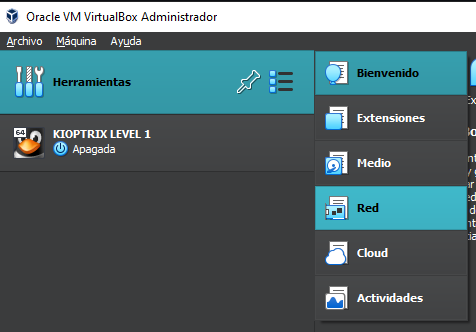

select tab: Nat Networks > Create

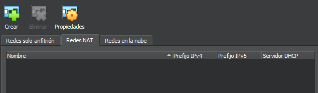

Edit properties.

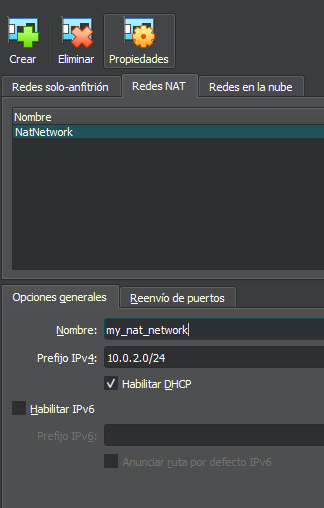

## Config the VM KIOPTRIX

Go to the main menu. Select the machine and before Network

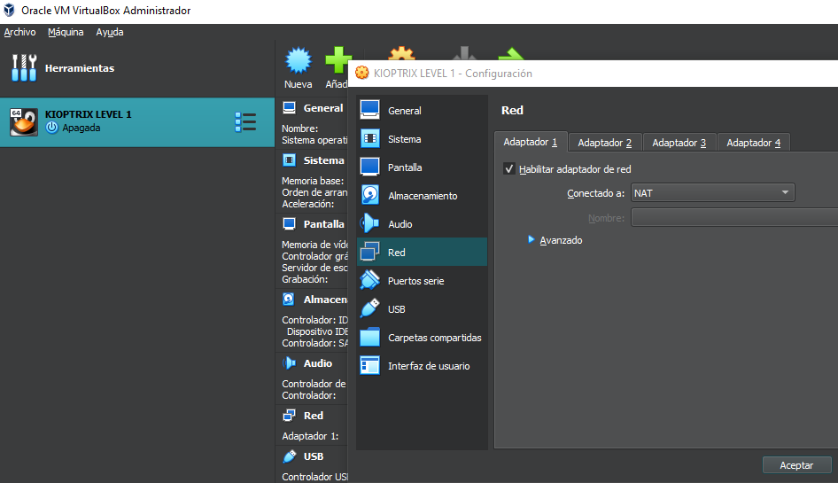

Change the conection to Nat Network.

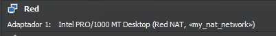

Select Storage ->Controller: IDE-> “Add Hard disk” button->“Choose Existing Disk”.->Search and add the Kioptrix VMDK disk file.

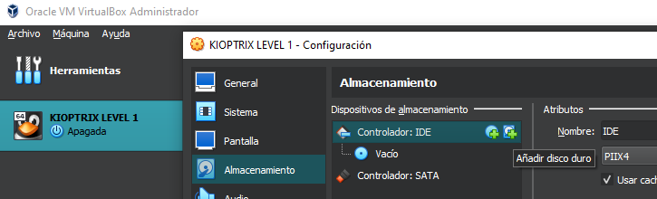

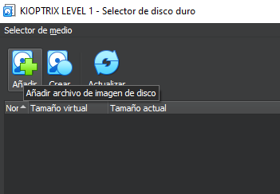

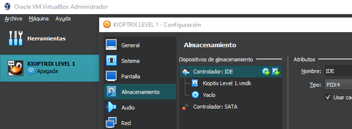

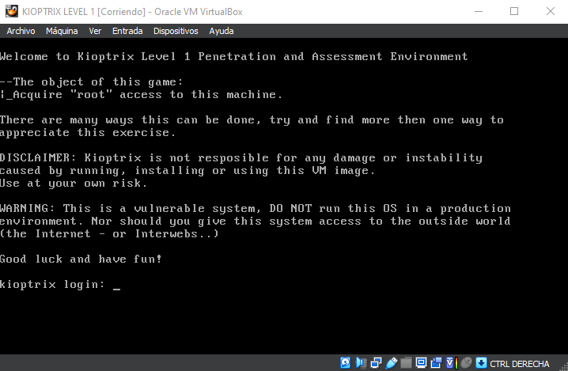