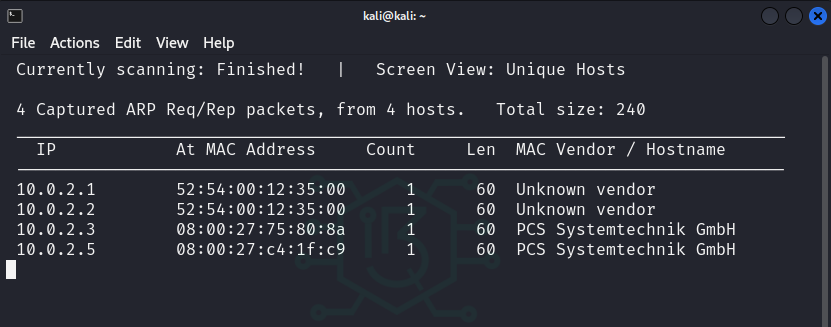
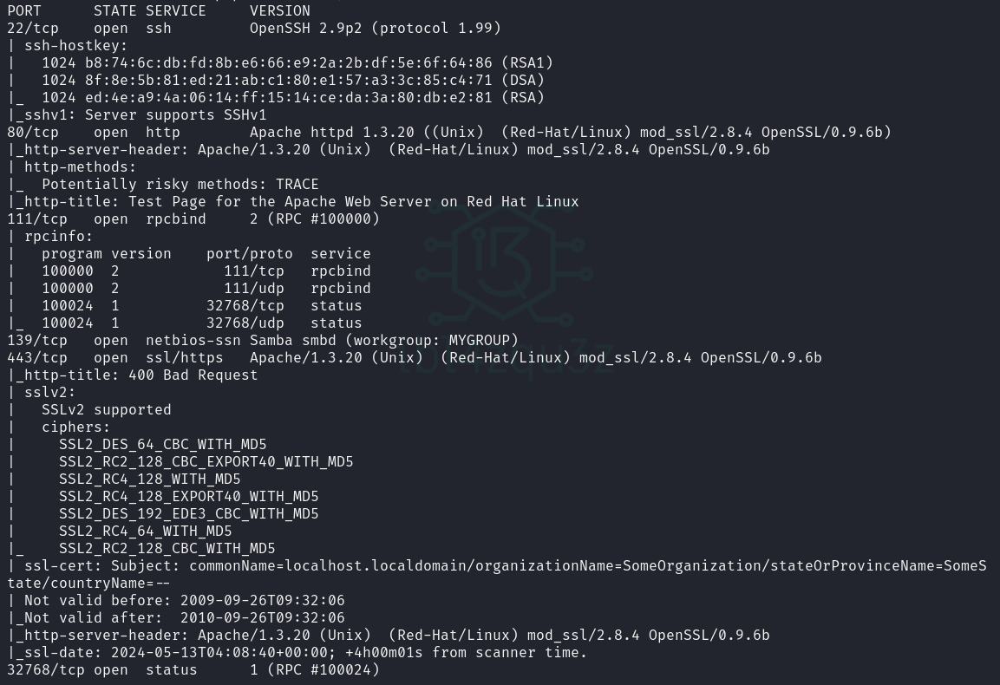

# KIOPTRIX LEVEL 1

**Date WriteUp**: DD / MM / YYYY
**Difficulty**: EASY

## MACHINE
**Name**: Kioptrix: Level 1 (#1)
**Date release**: 17 Feb 2010
**Author**: Kioptrix
**Series**: Kioptrix
**url**: https://www.vulnhub.com/entry/kioptrix-level-1-1,22/
**Web page**: http://www.kioptrix.com/blog/?page_id=135
**Download**:
Kioptrix_Level_1.rar (Size: 186 MB)
URL 1: http://www.kioptrix.com/dlvm/Kioptrix_Level_1.rar
URL (Mirror): https://download.vulnhub.com/kioptrix/Kioptrix_Level_1.rar

**Description**

This Kioptrix VM Image are easy challenges. The object of the game is to acquire root access via any means possible (except actually hacking the VM server or player). The purpose of these games are to learn the basic tools and techniques in vulnerability assessment and exploitation. There are more ways then one to successfully complete the challenges.


## Discover

```
sudo netdiscover -r 10.0.2.0/24 -i eth0
```



## Enumeration

```
sudo nmap -sS -sC -sV -O 10.0.2.5  
```

**MAC Address**: 08:00:27:C4:1F:C9 (Oracle VirtualBox virtual NIC)
**Device type**: general purpose|media device
**Running**: Linux 2.4.X, Roku embedded
**OS CPE**: cpe:/o:linux:linux_kernel:2.4 cpe:/h:roku:soundbridge_m1500
**OS details**: Linux 2.4.9 - 2.4.18 (likely embedded), Roku HD1500 media player




PORT      | STATE | SERVICE     | VERSION
----------|-------|-------------|---------------------------------------------------------------------------
22/tcp    | open  | ssh         | OpenSSH 2.9p2 (protocol 1.99)
80/tcp    | open  | http        | Apache httpd 1.3.20 ((Unix)  (Red-Hat/Linux) mod_ssl/2.8.4 OpenSSL/0.9.6b)
111/tcp   | open  | rpcbind     | 2 (RPC #100000)
139/tcp   | open  | netbios-ssn | Samba smbd (workgroup: MYGROUP)
443/tcp   | open  | ssl/https   | Apache/1.3.20 (Unix)  (Red-Hat/Linux) mod_ssl/2.8.4 OpenSSL/0.9.6b
32768/tcp | open  | status      | 1 (RPC #100024)


## Foothold

## Lateral Movement

## Privilege Escalation