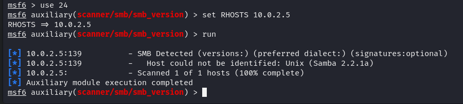
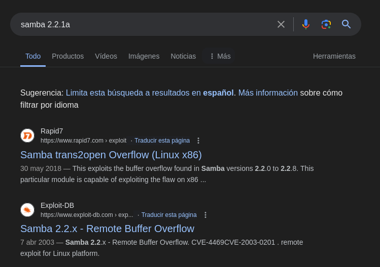
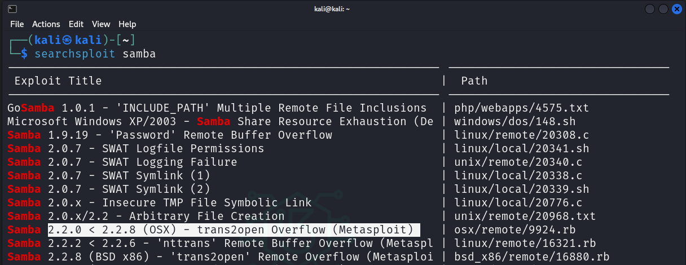
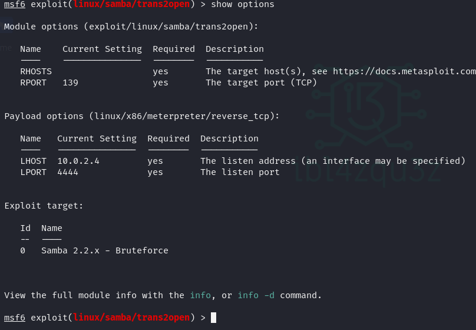
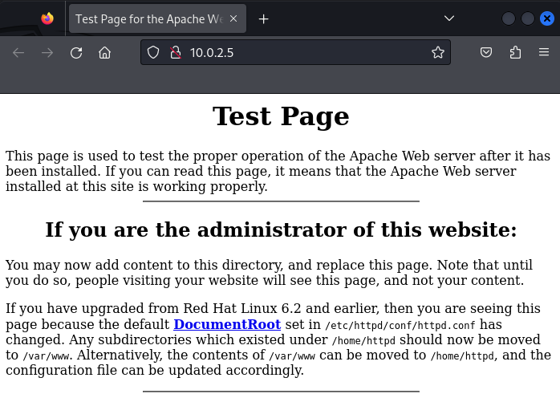
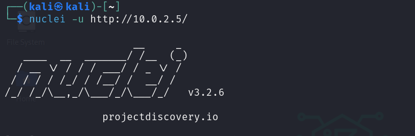

# KIOPTRIX LEVEL 1

**Date WriteUp**: DD / MM / YYYY
**Difficulty**: EASY

## MACHINE
**Name**: Kioptrix: Level 1 (#1)
**Date release**: 17 Feb 2010
**Author**: Kioptrix
**Series**: Kioptrix
**url**: https://www.vulnhub.com/entry/kioptrix-level-1-1,22/
**Web page**: http://www.kioptrix.com/blog/?page_id=135
**Download**:
Kioptrix_Level_1.rar (Size: 186 MB)
URL 1: http://www.kioptrix.com/dlvm/Kioptrix_Level_1.rar
URL (Mirror): https://download.vulnhub.com/kioptrix/Kioptrix_Level_1.rar

**Description**

This Kioptrix VM Image are easy challenges. The object of the game is to acquire root access via any means possible (except actually hacking the VM server or player). The purpose of these games are to learn the basic tools and techniques in vulnerability assessment and exploitation. There are more ways then one to successfully complete the challenges.


Resolucion
Usaré una distribucion Kali OS como maquina atacante.


## Discover

Para el escaneo de red para descubrir las maquinas utilizo la herramienta netdiscover

```
sudo netdiscover -r 10.0.2.0/24 -i eth0
```


## Enumeration

```
sudo nmap -sS -sC -sV -O 10.0.2.5  
```

**MAC Address**: 08:00:27:C4:1F:C9 (Oracle VirtualBox virtual NIC)
**Device type**: general purpose|media device
**Running**: Linux 2.4.X, Roku embedded
**OS CPE**: cpe:/o:linux:linux_kernel:2.4 cpe:/h:roku:soundbridge_m1500
**OS details**: Linux 2.4.9 - 2.4.18 (likely embedded), Roku HD1500 media player


PORT      | STATE | SERVICE     | VERSION
----------|-------|-------------|---------------------------------------------------------------------------
22/tcp    | open  | ssh         | OpenSSH 2.9p2 (protocol 1.99)
80/tcp    | open  | http        | Apache httpd 1.3.20 ((Unix)  (Red-Hat/Linux) mod_ssl/2.8.4 OpenSSL/0.9.6b)
111/tcp   | open  | rpcbind     | 2 (RPC #100000)
139/tcp   | open  | netbios-ssn | Samba smbd (workgroup: MYGROUP)
443/tcp   | open  | ssl/https   | Apache/1.3.20 (Unix)  (Red-Hat/Linux) mod_ssl/2.8.4 OpenSSL/0.9.6b
32768/tcp | open  | status      | 1 (RPC #100024)


### Puerto 139

msfconsole

search smb_


use 24
set RHOSTS 10.0.2.5
run










### Puerto 80







```
nikto -h 10.0.2.5   
- Nikto v2.5.0
---------------------------------------------------------------------------
+ Target IP:          10.0.2.5
+ Target Hostname:    10.0.2.5
+ Target Port:        80
+ Start Time:         2024-05-12 20:53:32 (GMT-4)
---------------------------------------------------------------------------
+ Server: Apache/1.3.20 (Unix)  (Red-Hat/Linux) mod_ssl/2.8.4 OpenSSL/0.9.6b
+ /: Server may leak inodes via ETags, header found with file /, inode: 34821, size: 2890, mtime: Wed Sep  5 23:12:46 2001. See: http://cve.mitre.org/cgi-bin/cvename.cgi?name=CVE-2003-1418
+ /: The anti-clickjacking X-Frame-Options header is not present. See: https://developer.mozilla.org/en-US/docs/Web/HTTP/Headers/X-Frame-Options
+ /: The X-Content-Type-Options header is not set. This could allow the user agent to render the content of the site in a different fashion to the MIME type. See: https://www.netsparker.com/web-vulnerability-scanner/vulnerabilities/missing-content-type-header/
+ /: Apache is vulnerable to XSS via the Expect header. See: http://cve.mitre.org/cgi-bin/cvename.cgi?name=CVE-2006-3918
+ mod_ssl/2.8.4 appears to be outdated (current is at least 2.9.6) (may depend on server version).
+ Apache/1.3.20 appears to be outdated (current is at least Apache/2.4.54). Apache 2.2.34 is the EOL for the 2.x branch.
+ OpenSSL/0.9.6b appears to be outdated (current is at least 3.0.7). OpenSSL 1.1.1s is current for the 1.x branch and will be supported until Nov 11 2023.
+ OPTIONS: Allowed HTTP Methods: GET, HEAD, OPTIONS, TRACE .
+ /: HTTP TRACE method is active which suggests the host is vulnerable to XST. See: https://owasp.org/www-community/attacks/Cross_Site_Tracing
+ Apache/1.3.20 - Apache 1.x up 1.2.34 are vulnerable to a remote DoS and possible code execution.
+ Apache/1.3.20 - Apache 1.3 below 1.3.27 are vulnerable to a local buffer overflow which allows attackers to kill any process on the system.
+ Apache/1.3.20 - Apache 1.3 below 1.3.29 are vulnerable to overflows in mod_rewrite and mod_cgi.
+ mod_ssl/2.8.4 - mod_ssl 2.8.7 and lower are vulnerable to a remote buffer overflow which may allow a remote shell.
+ ///etc/hosts: The server install allows reading of any system file by adding an extra '/' to the URL.
+ /usage/: Webalizer may be installed. Versions lower than 2.01-09 vulnerable to Cross Site Scripting (XSS). See: http://cve.mitre.org/cgi-bin/cvename.cgi?name=CVE-2001-0835
+ /manual/: Directory indexing found.
+ /manual/: Web server manual found.
+ /icons/: Directory indexing found.
+ /icons/README: Apache default file found. See: https://www.vntweb.co.uk/apache-restricting-access-to-iconsreadme/
+ /test.php: This might be interesting.
+ /wp-content/themes/twentyeleven/images/headers/server.php?filesrc=/etc/hosts: A PHP backdoor file manager was found.
+ /wordpress/wp-content/themes/twentyeleven/images/headers/server.php?filesrc=/etc/hosts: A PHP backdoor file manager was found.
+ /wp-includes/Requests/Utility/content-post.php?filesrc=/etc/hosts: A PHP backdoor file manager was found.
+ /wordpress/wp-includes/Requests/Utility/content-post.php?filesrc=/etc/hosts: A PHP backdoor file manager was found.
+ /wp-includes/js/tinymce/themes/modern/Meuhy.php?filesrc=/etc/hosts: A PHP backdoor file manager was found.
+ /wordpress/wp-includes/js/tinymce/themes/modern/Meuhy.php?filesrc=/etc/hosts: A PHP backdoor file manager was found.
+ /assets/mobirise/css/meta.php?filesrc=: A PHP backdoor file manager was found.
+ /login.cgi?cli=aa%20aa%27cat%20/etc/hosts: Some D-Link router remote command execution.
+ /shell?cat+/etc/hosts: A backdoor was identified.
+ /#wp-config.php#: #wp-config.php# file found. This file contains the credentials.
+ 8908 requests: 0 error(s) and 30 item(s) reported on remote host
+ End Time:           2024-05-12 20:53:53 (GMT-4) (21 seconds)
---------------------------------------------------------------------------
+ 1 host(s) tested
```


## Foothold

## Lateral Movement

## Privilege Escalation