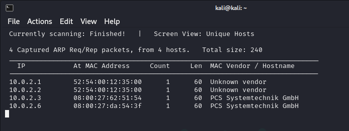
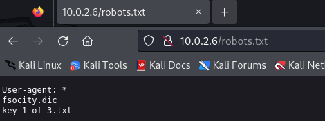
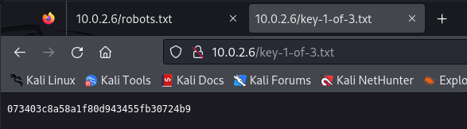
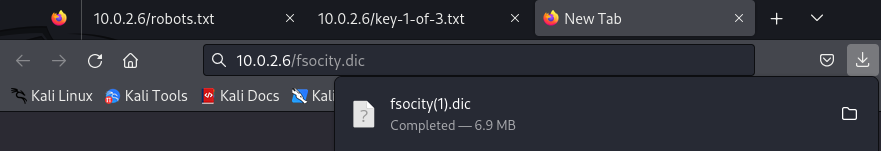
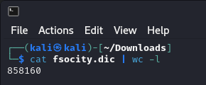
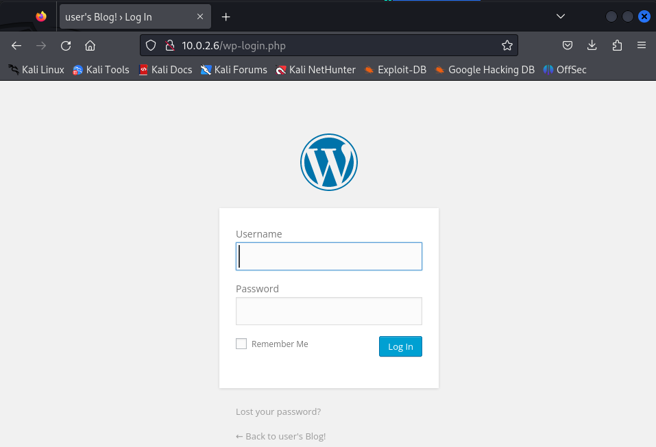
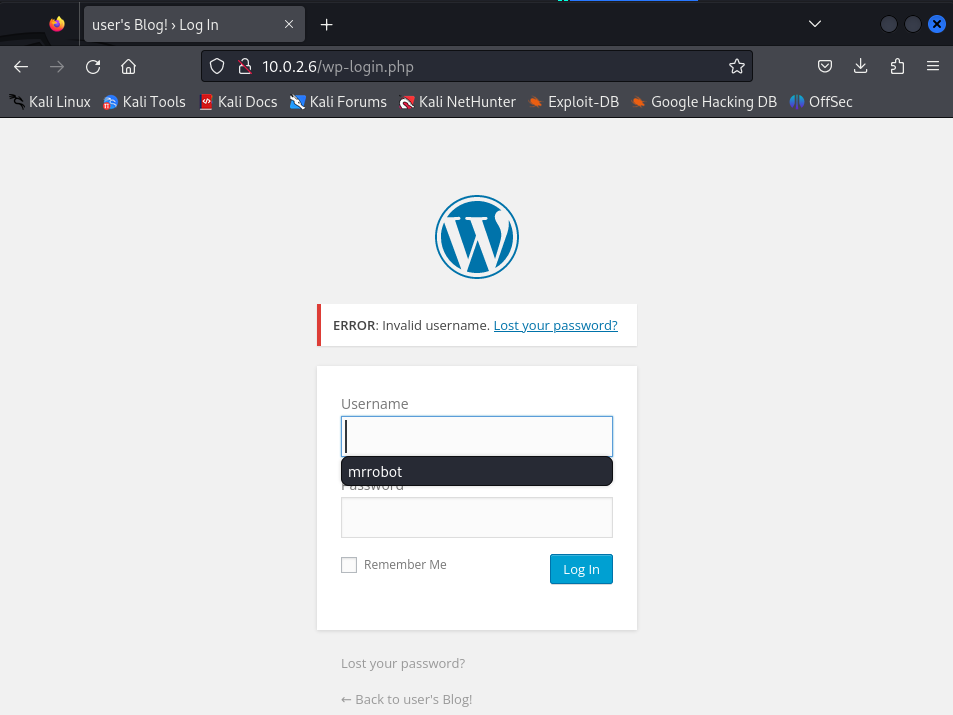
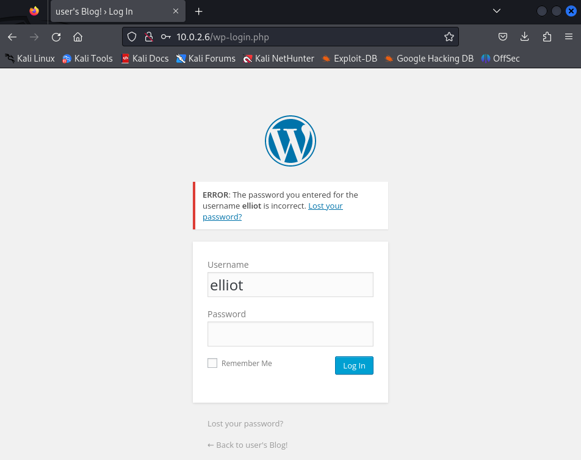
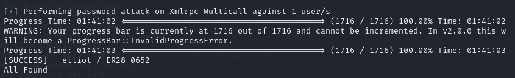
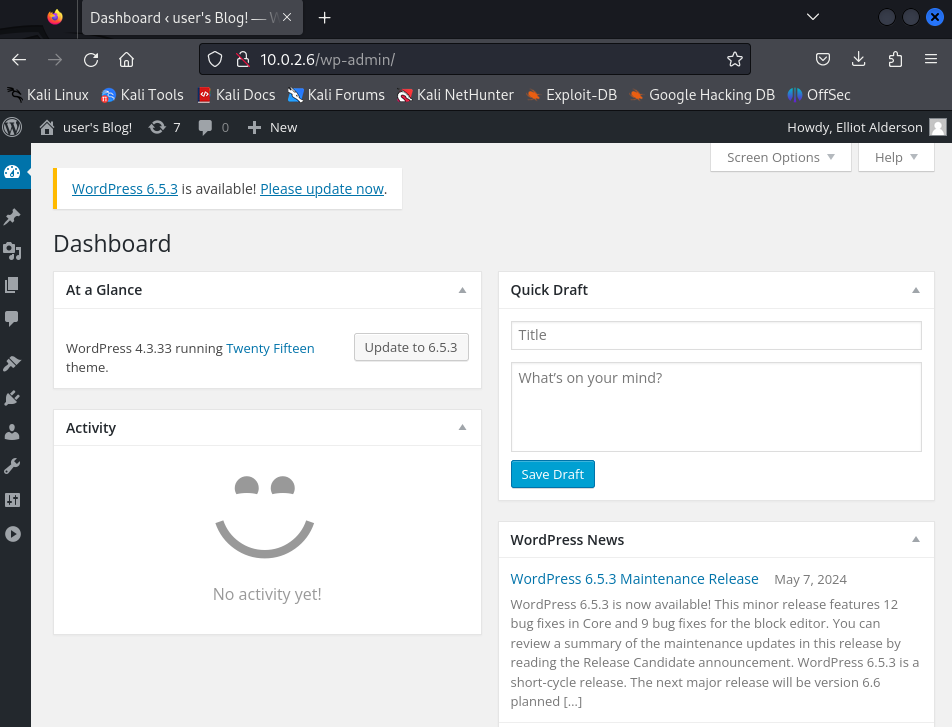

# MR ROBOT 1

**Date WriteUp**: DD / MM / YYYY
**Difficulty**: beginner-intermediate

## MACHINE
**Name**: Mr Robot 1
**Date release**: 28 Jun 2016
**Author**: Leon Johnson
**Series**: Mr-Robot

**File Information**
- **Filename**: mrRobot.ova
- **File size**: 704MB

**Download**
mrRobot.ova (Size: 704MB)
Download (Mirror): https://download.vulnhub.com/mrrobot/mrRobot.ova

**Checksum**
- **MD5**: BC02C42815EAC4E872D753E1FD12DDC8
- **SHA1**: DC0EB84DA4C62284C688590EE092868CE84A09AB

**Description**

Based on the show, Mr. Robot.

This VM has three keys hidden in different locations. Your goal is to find all three. Each key is progressively difficult to find.

The VM isn't too difficult. There isn't any advanced exploitation or reverse engineering. The level is considered beginner-intermediate.

Resolucion 

Usaré una distribucion Kali OS como maquina atacante.


## Fase de Fingerprinting / Reconocimiento (Reconnaissance): 

### Descubrimiento de IP objetivo en la red

```bash
sudo netdiscover -r 10.0.2.0/24 -i eth0
```



### Descubrimiento de Puertos en objetivo

sudo nmap -sS -sC -sV -O 10.0.2.6

PORT    | STATE  | SERVICE  | VERSION
--------|--------|----------|-------------
22/tcp  | closed | ssh      |
80/tcp  | open   | http     | Apache httpd
443/tcp | open   | ssl/http | Apache httpd

Linux 3.10 - 4.11 (98%)

## Fase de Footprinting / Exploración (Scanning):

### Exploracion puerto 80

Navegacion en el puerto 80 presenta una animacion de estilo mr robot y nos da un menu donde podemos realizar ciertas acciones, ver videos, etc.jo


**Escaneo nuclei**

```bash
└─$ nuclei -u http://10.0.2.6
```

```bash

                     __     _
   ____  __  _______/ /__  (_)
  / __ \/ / / / ___/ / _ \/ /
 / / / / /_/ / /__/ /  __/ /
/_/ /_/\__,_/\___/_/\___/_/   v3.2.6

                projectdiscovery.io

[INF] Current nuclei version: v3.2.6 (outdated)
[INF] Current nuclei-templates version: v9.8.6 (latest)
[WRN] Scan results upload to cloud is disabled.
[INF] New templates added in latest release: 65
[INF] Templates loaded for current scan: 7957
[INF] Executing 7957 signed templates from projectdiscovery/nuclei-templates
[INF] Targets loaded for current scan: 1
[INF] Templates clustered: 1483 (Reduced 1402 Requests)
[tls-version] [ssl] [info] 10.0.2.6:443 ["tls10"]
[tls-version] [ssl] [info] 10.0.2.6:443 ["tls11"]
[tls-version] [ssl] [info] 10.0.2.6:443 ["tls12"]
[weak-cipher-suites:tls-1.0] [ssl] [low] 10.0.2.6:443 ["[tls10 TLS_ECDHE_RSA_WITH_AES_256_CBC_SHA]"]
[weak-cipher-suites:tls-1.1] [ssl] [low] 10.0.2.6:443 ["[tls11 TLS_ECDHE_RSA_WITH_AES_256_CBC_SHA]"]
[INF] Using Interactsh Server: oast.fun
[apache-detect] [http] [info] http://10.0.2.6 ["Apache"]
[pagespeed-detect] [http] [info] http://10.0.2.6
[wordpress-contact-form-7:outdated_version] [http] [info] http://10.0.2.6/wp-content/plugins/contact-form-7/readme.txt ["4.1"]
[CVE-2020-35489] [http] [critical] http://10.0.2.6/wp-content/plugins/contact-form-7/readme.txt ["4.1"]
[http-missing-security-headers:x-content-type-options] [http] [info] http://10.0.2.6                                                                
[http-missing-security-headers:cross-origin-embedder-policy] [http] [info] http://10.0.2.6                                                          
[http-missing-security-headers:cross-origin-resource-policy] [http] [info] http://10.0.2.6
[http-missing-security-headers:strict-transport-security] [http] [info] http://10.0.2.6
[http-missing-security-headers:content-security-policy] [http] [info] http://10.0.2.6
[http-missing-security-headers:permissions-policy] [http] [info] http://10.0.2.6
[http-missing-security-headers:cross-origin-opener-policy] [http] [info] http://10.0.2.6
[http-missing-security-headers:x-permitted-cross-domain-policies] [http] [info] http://10.0.2.6                                                     
[http-missing-security-headers:referrer-policy] [http] [info] http://10.0.2.6
[http-missing-security-headers:clear-site-data] [http] [info] http://10.0.2.6
[wordpress-login] [http] [info] http://10.0.2.6/wp-login.php
[wordpress-readme-file] [http] [info] http://10.0.2.6/readme.html
[robots-txt-endpoint] [http] [info] http://10.0.2.6/robots.txt
[waf-detect:apachegeneric] [http] [info] http://10.0.2.6
[wordpress-all-in-one-seo-pack:detected_version] [http] [info] http://10.0.2.6/wp-content/plugins/all-in-one-seo-pack/readme.txt ["trunk"] [last_version="4.5.4"]                                                             
[wordpress-all-in-one-wp-migration:outdated_version] [http] [info] http://10.0.2.6/wp-content/plugins/all-in-one-wp-migration/readme.txt ["2.0.4"] [last_version="7.79"]                                                      
[wordpress-detect:version_by_js] [http] [info] http://10.0.2.6/wp-admin/install.php ["4.3.33"]
[wordpress-google-analytics-for-wordpress:outdated_version] [http] [info] http://10.0.2.6/wp-content/plugins/google-analytics-for-wordpress/readme.txt ["5.3.2"] [last_version="8.21.0"]
[wordpress-google-sitemap-generator:outdated_version] [http] [info] http://10.0.2.6/wp-content/plugins/google-sitemap-generator/readme.txt ["4.0.7.1"] [last_version="4.1.13"]                                                
[wordpress-jetpack:outdated_version] [http] [info] http://10.0.2.6/wp-content/plugins/jetpack/readme.txt ["3.3.2"] [last_version="12.8.1"]
[wordpress-wp-mail-smtp:outdated_version] [http] [info] http://10.0.2.6/wp-content/plugins/wp-mail-smtp/readme.txt ["0.9.5"] [last_version="3.10.0"]
[wordpress-xmlrpc-listmethods] [http] [info] http://10.0.2.6/xmlrpc.php
[wp-license-file] [http] [info] http://10.0.2.6/license.txt
[wordpress-xmlrpc-file] [http] [info] http://10.0.2.6/xmlrpc.php
[self-signed-ssl] [ssl] [low] 10.0.2.6:443
```

Compruebo : [robots-txt-endpoint] [http] [info] http://10.0.2.6/robots.txt   



Accedo a http://10.0.2.6/key-1-of-3.txt



Obtengo la primera flag: [073403c8a58a1f80d943455fb30724b9]

Accedo a http://10.0.2.6/fsocity.dic y se descarga un diccionario.






**Escaneo nikto**

```
└─$ nikto -h 10.0.2.6 
```

```
- Nikto v2.5.0
---------------------------------------------------------------------------
+ Target IP:          10.0.2.6
+ Target Hostname:    10.0.2.6
+ Target Port:        80
+ Start Time:         2024-05-14 03:37:56 (GMT-4)
---------------------------------------------------------------------------
+ Server: Apache
+ /: The X-Content-Type-Options header is not set. This could allow the usetype. See: https://www.netsparker.com/web-vulnerability-scanner/vulnerabili
+ /UvlMnCqi.xbb: Retrieved x-powered-by header: PHP/5.5.29.
+ No CGI Directories found (use '-C all' to force check all possible dirs)
+ /index: Uncommon header 'tcn' found, with contents: list.
+ /index: Apache mod_negotiation is enabled with MultiViews, which allows adex' were found: index.html, index.php. See: http://www.wisec.it/sectou.php
+ /admin/: This might be interesting.
+ /image/: Drupal Link header found with value: <http://10.0.2.6/?p=23>; rel=shortlink. See: https://www.drupal.org/                                
+ /wp-links-opml.php: This WordPress script reveals the installed version.
+ /license.txt: License file found may identify site software.            
+ /admin/index.html: Admin login page/section found.                      
+ /wp-login/: Cookie wordpress_test_cookie created without the httponly flag. See: https://developer.mozilla.org/en-US/docs/Web/HTTP/Cookies         
+ /wp-login/: Admin login page/section found.                             
+ /wordpress/: A Wordpress installation was found.                        
+ /wp-admin/wp-login.php: Wordpress login found.                          
+ /wordpress/wp-admin/wp-login.php: Wordpress login found.                
+ /blog/wp-login.php: Wordpress login found.                              
+ /wp-login.php: Wordpress login found.                                   
+ /wordpress/wp-login.php: Wordpress login found.                         
+ /#wp-config.php#: #wp-config.php# file found. This file contains the credentials.
+ 8102 requests: 0 error(s) and 18 item(s) reported on remote host
+ End Time:           2024-05-14 03:44:26 (GMT-4) (390 seconds)
---------------------------------------------------------------------------
+ 1 host(s) tested
```

Nos da un 


Nos da un wp-login.php 

Compruebo acceso








**Escaneo WPSCAN**

└─$ wpscan --url http://10.0.2.6 

```
_______________________________________________________________
         __          _______   _____
         \ \        / /  __ \ / ____|
          \ \  /\  / /| |__) | (___   ___  __ _ _ __ ®
           \ \/  \/ / |  ___/ \___ \ / __|/ _` | '_ \
            \  /\  /  | |     ____) | (__| (_| | | | |
             \/  \/   |_|    |_____/ \___|\__,_|_| |_|

         WordPress Security Scanner by the WPScan Team
                         Version 3.8.25
                               
       @_WPScan_, @ethicalhack3r, @erwan_lr, @firefart
_______________________________________________________________

[i] Updating the Database ...
[i] Update completed.

[+] URL: http://10.0.2.6/ [10.0.2.6]
[+] Started: Tue May 14 04:25:12 2024

Interesting Finding(s):

[+] Headers
 | Interesting Entries:
 |  - Server: Apache
 |  - X-Mod-Pagespeed: 1.9.32.3-4523
 | Found By: Headers (Passive Detection)
 | Confidence: 100%

[+] robots.txt found: http://10.0.2.6/robots.txt
 | Found By: Robots Txt (Aggressive Detection)
 | Confidence: 100%

[+] XML-RPC seems to be enabled: http://10.0.2.6/xmlrpc.php
 | Found By: Direct Access (Aggressive Detection)
 | Confidence: 100%
 | References:
 |  - http://codex.wordpress.org/XML-RPC_Pingback_API
 |  - https://www.rapid7.com/db/modules/auxiliary/scanner/http/wordpress_ghost_scanner/
 |  - https://www.rapid7.com/db/modules/auxiliary/dos/http/wordpress_xmlrpc_dos/
 |  - https://www.rapid7.com/db/modules/auxiliary/scanner/http/wordpress_xmlrpc_login/
 |  - https://www.rapid7.com/db/modules/auxiliary/scanner/http/wordpress_pingback_access/

[+] WordPress readme found: http://10.0.2.6/readme.html
 | Found By: Direct Access (Aggressive Detection)
 | Confidence: 100%

[+] The external WP-Cron seems to be enabled: http://10.0.2.6/wp-cron.php
 | Found By: Direct Access (Aggressive Detection)
 | Confidence: 60%
 | References:
 |  - https://www.iplocation.net/defend-wordpress-from-ddos
 |  - https://github.com/wpscanteam/wpscan/issues/1299

[+] WordPress version 4.3.33 identified (Outdated, released on 2024-01-30).
 | Found By: Emoji Settings (Passive Detection)
 |  - http://10.0.2.6/25e4ccb.html, Match: '-release.min.js?ver=4.3.33'
 | Confirmed By: Meta Generator (Passive Detection)
 |  - http://10.0.2.6/25e4ccb.html, Match: 'WordPress 4.3.33'

[+] WordPress theme in use: twentyfifteen
 | Location: http://10.0.2.6/wp-content/themes/twentyfifteen/
 | Last Updated: 2024-04-02T00:00:00.000Z
 | Readme: http://10.0.2.6/wp-content/themes/twentyfifteen/readme.txt
 | [!] The version is out of date, the latest version is 3.7
 | Style URL: http://10.0.2.6/wp-content/themes/twentyfifteen/style.css?ver=4.3.33
 | Style Name: Twenty Fifteen
 | Style URI: https://wordpress.org/themes/twentyfifteen/
 | Description: Our 2015 default theme is clean, blog-focused, and designed for clarity. Twenty Fifteen's simple, st...
 | Author: the WordPress team
 | Author URI: https://wordpress.org/
 |
 | Found By: Css Style In 404 Page (Passive Detection)
 |
 | Version: 1.3 (80% confidence)
 | Found By: Style (Passive Detection)
 |  - http://10.0.2.6/wp-content/themes/twentyfifteen/style.css?ver=4.3.33, Match: 'Version: 1.3'

[+] Enumerating All Plugins (via Passive Methods)

[i] No plugins Found.

[+] Enumerating Config Backups (via Passive and Aggressive Methods)
 Checking Config Backups - Time: 00:00:02 <======> (137 / 137) 100.00% Time: 00:00:02

[i] No Config Backups Found.

[!] No WPScan API Token given, as a result vulnerability data has not been output.
[!] You can get a free API token with 25 daily requests by registering at https://wpscan.com/register

[+] Finished: Tue May 14 04:25:21 2024
[+] Requests Done: 186
[+] Cached Requests: 6
[+] Data Sent: 43.203 KB
[+] Data Received: 21.35 MB
[+] Memory used: 279.02 MB
[+] Elapsed time: 00:00:09
```

Como tengo el diccionario que encontre en robots.txt lo uso para hacer fuerza bruta al usuario elliot de wordpress

└─$ wpscan --url http://10.0.2.6 -P /home/kali/Downloads/fsocity.dic  -U 'elliot'



Nos da la clave: [SUCCESS] - elliot / ER28-0652 




**Escaneo dirb**

```
└─$ dirb http://10.0.2.6
```


#### Resumen de resultados puerto 80

Se detecta una instalacion de wordpress
Se detecta el acceso a wp-login.php 
Se detecta fichero robots.txt

Resultados interesantes:

```
[wordpress-login] [http] [info] http://10.0.2.6/wp-login.php
[wordpress-readme-file] [http] [info] http://10.0.2.6/readme.html
[robots-txt-endpoint] [http] [info] http://10.0.2.6/robots.txt
```

### Resumen de resultados de escaneos con nmap

### Escaneo de vulnerabilidades con vulscan

## Fase de Explotacion / Obtención de Acceso (Gaining Access):

### Puerto XX

## Lateral Movement

## Privilege Escalation